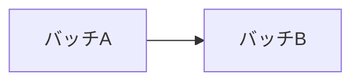
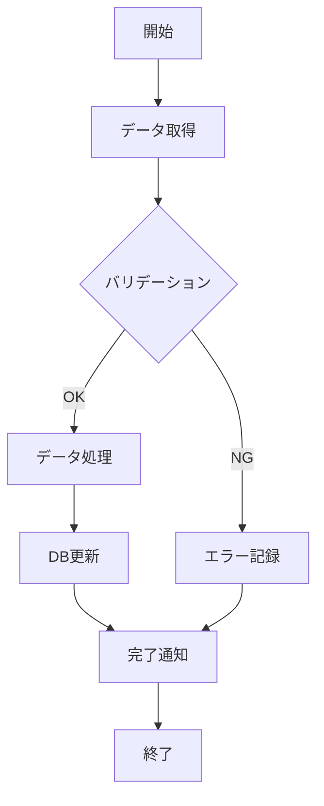

# バッチ設計 作成ガイド

## 目次

1. [バッチ一覧 (batch-list.md)](#バッチ一覧)
2. [個別バッチ定義 (batch-definitions/)](#個別バッチ定義)

## 作成順序

batch-list.md → 個別バッチ定義 の順に作成する。
バッチ一覧で全バッチ処理を洗い出し、その後各バッチの詳細仕様を定義する。

## 参照すべきドキュメント

- `docs/01-requirements/business-requirements/business-flow.md` — 業務フロー（バッチの必要性の根拠）
- `docs/01-requirements/functional-requirements/` — 各機能の要件（バッチで実現する機能）
- `docs/02-technical-design/infrastructure/cloud-architecture.md` — バッチ実行基盤
- `docs/02-technical-design/operations/monitoring.md` — バッチ監視方針
- `docs/03-basic-design/data-model/` — データモデル（バッチの操作対象）

---

## バッチ一覧

### バッチ一覧に含める内容

テーブル形式で全バッチ処理を一覧化する。

**一覧テーブルのフォーマット:**

※ 以下は記載例。プロジェクトのバッチ処理に応じて置き換えること。

| No | バッチID | バッチ名 | 種別 | 実行タイミング | 実行時間目安 | 概要 |
|----|---------|---------|------|--------------|------------|------|
| 1 | BAT-001 | （例）データ同期 | 定期実行 | 毎時0分 | 5分以内 | 外部データソースとの同期 |
| 2 | BAT-002 | （例）レポート生成 | 定期実行 | 毎日2:00 | 30分以内 | 日次集計レポート生成 |

**バッチ種別の分類:**

| 種別 | 説明 | 例 |
|------|------|-----|
| 定期実行 | cron等で定期的に実行 | 在庫同期、レポート生成 |
| イベント駆動 | 特定のイベントをトリガーに実行 | 注文確定後の処理 |
| 手動実行 | 管理者が手動で実行 | データ移行、一括更新 |
| 日次 | 1日1回、主に深夜に実行 | 集計、クリーンアップ |

### バッチ間依存関係

バッチ間に実行順序の依存がある場合、Mermaid図で図示する。

**記載すべき項目:**
- 先行バッチ・後続バッチの関係
- 並列実行可能なバッチの明示
- 排他制御が必要なバッチの組み合わせ

### 品質基準

- 業務フロー・機能要件から導出されるすべてのバッチ処理が一覧に含まれていること
- 実行タイミングが業務要件と整合していること
- バッチ間の依存関係が明確であること

---

## 個別バッチ定義

### 各バッチ定義ファイルに含める内容

バッチごとに1ファイル作成し、以下の内容を記載する。

#### バッチ概要

テーブル形式で基本情報を記載する。

| 項目 | 内容 |
|------|------|
| バッチID | BAT-XXX |
| バッチ名 | バッチ名称 |
| 種別 | 定期実行 / イベント駆動 / 手動実行 |
| 実行タイミング | cron式 or トリガー条件 |
| 実行時間目安 | X分以内 |
| 対象データ量 | 想定されるデータ件数 |
| 対応機能要件 | FR-XXX |

#### 処理概要

バッチの目的と処理の概要を記載する。

**記載すべき項目:**
- バッチの目的（なぜこのバッチが必要か）
- 業務上の位置づけ
- 前提条件（先行バッチの完了等）

#### 入力データ

バッチが読み取るデータを定義する。

| No | データソース | テーブル / ファイル | 取得条件 | 備考 |
|----|------------|-------------------|---------|------|
| 1 | （例）RDB | orders | status = 'completed' AND date = 前日 | — |
| 2 | （例）外部API | 在庫管理API | 全商品 | API制限: 100件/リクエスト |

#### 処理フロー

Mermaid記法でバッチの処理フローを図示する。

**Mermaid記法の例:**

**記載すべき項目:**
- メインフロー（正常系）
- 分岐条件
- エラーフローへの遷移ポイント

#### 処理詳細

処理のステップを詳細に記載する。

| ステップ | 処理内容 | 対象テーブル | 備考 |
|---------|---------|------------|------|
| 1 | （例）対象データ取得 | orders | 前日分を抽出 |
| 2 | （例）集計処理 | — | 売上合計、注文件数 |
| 3 | （例）レポート生成 | — | CSV形式 |
| 4 | （例）結果保存 | daily_reports | INSERT |
| 5 | （例）ファイル出力 | S3 | reports/daily/ |

#### 出力データ

バッチが出力するデータを定義する。

| No | 出力先 | テーブル / ファイル | 出力形式 | 備考 |
|----|--------|-------------------|---------|------|
| 1 | （例）RDB | daily_reports | INSERT | — |
| 2 | （例）S3 | reports/daily/{date}.csv | CSV | UTF-8 BOM付き |

#### エラーハンドリング

**エラー分類と対応:**

| エラー種別 | 対応方針 | リトライ | 通知 |
|-----------|---------|---------|------|
| データ取得エラー | リトライ後、失敗時はスキップ | 3回 | 警告通知 |
| バリデーションエラー | エラーレコードをスキップし継続 | なし | 警告通知 |
| DB更新エラー | トランザクションロールバック | 3回 | エラー通知 |
| 外部APIエラー | リトライ後、失敗時は中断 | 5回（指数バックオフ） | エラー通知 |
| タイムアウト | 処理中断 | なし | エラー通知 |

**リトライ方針:**
- リトライ間隔: 指数バックオフ（1秒、2秒、4秒...）
- 最大リトライ回数: エラー種別ごとに定義
- デッドレターキュー: リトライ上限超過時の退避先

**障害時の復旧方針:**
- 冪等性の確保方針（再実行可能な設計）
- 部分実行時のリカバリ手順
- 手動リラン時の注意事項

#### 監視・ログ

| 項目 | 内容 |
|------|------|
| 実行ログ | 開始・終了・処理件数・エラー件数 |
| 監視アラート | 実行時間超過、エラー率閾値超過 |
| メトリクス | 処理件数、処理時間、エラー率 |

### 品質基準

- 入力・出力データがデータモデルのテーブル定義と整合していること
- すべてのエラーケースに対応方針が定義されていること
- 冪等性（再実行可能性）が考慮されていること
- 監視・ログの方針が運用方式と整合していること
- 実行時間の目安が非機能要件と整合していること
