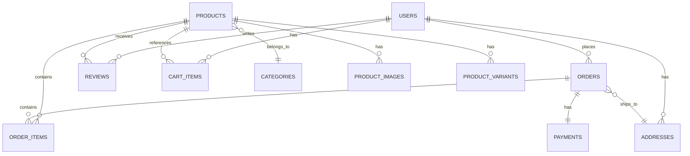

# データモデル 作成ガイド

## 目次

1. [ER図 (er-diagram.md)](#er図)
2. [テーブル定義 (table-definitions/)](#テーブル定義)
3. [マスタデータ定義 (master-data.md)](#マスタデータ定義)

## Smallテンプレートの場合

Smallテンプレートでは、ER図・テーブル定義・マスタデータ定義を **`data-model.md`** 1ファイルに統合して記述する。

### 推奨構成

```markdown
# データモデル

## ER図

{Mermaid erDiagram: 主要エンティティの関連図}

## テーブル定義

### {テーブル名1}（TBL-001）

| カラム名 | 型 | NULL | 説明 |
|----------|-----|------|------|
| id | BIGINT | NO | PK |
| ... | ... | ... | ... |

### {テーブル名2}（TBL-002）
{同様の構成}

## マスタデータ
{主要なマスタテーブルの初期データ概要をテーブルで記載}
```

### Fullとの主な差異

- ER図・テーブル定義・マスタデータを1ファイルにまとめる
- テーブル定義は主要テーブルに絞る（共通カラム（created_at等）の詳細説明は省略可）
- マスタデータ定義は主要なもののみ簡潔に記載
- インデックス定義・制約の詳細は省略可（主要なユニーク制約・外部キーは記載する）
- 以下の各セクション別ガイドの内容を参考にしつつ、小規模プロジェクトに必要十分な粒度でまとめる

---

## 作成順序（Fullテンプレート）

er-diagram.md → テーブル定義 → master-data.md の順に作成する。
ER図で全体のエンティティ関連を確定し、テーブル定義で各テーブルの詳細を定義、最後にマスタデータの初期値を定義する。

## 参照すべきドキュメント

- `docs/01-requirements/functional-requirements/` — 各機能が扱うデータの根拠
- `docs/01-requirements/business-requirements/business-rules.md` — データに関するビジネスルール
- `docs/02-technical-design/data/database-selection.md` — DB選定方針（RDBMS種別、型の制約）
- `docs/02-technical-design/data/caching-strategy.md` — キャッシュ対象の確認
- `docs/02-technical-design/security/data-protection.md` — データ保護要件（暗号化対象カラム等）

---

## ER図

### ER図（全体）に含める内容

MermaidのerDiagram記法でデータベース全体のER図を記載する。

**Mermaid記法の例（ECサイトの場合）:**



※ 上記はECサイトの場合の一例。プロジェクトのドメインモデルに応じてエンティティ・リレーションシップを定義すること。

**記載すべき項目:**
- すべてのエンティティ（テーブル）
- エンティティ間のリレーションシップ（1:1, 1:N, N:N）
- カーディナリティ（必須 / 任意）

### エンティティ関連説明に含める内容

主要なリレーションシップを補足説明する。

**記載すべき項目:**
- 各リレーションシップの業務上の意味
- 多対多の関連がある場合の中間テーブルの説明
- 論理削除 vs 物理削除の方針
- データのライフサイクル（作成→更新→削除/アーカイブ）

### エンティティグループ分類

関連するエンティティをグループ化して整理する。

※ 以下はECサイトの場合の一例。プロジェクトのドメインに応じてグループ分けすること。

| グループ | エンティティ | 説明 |
|---------|------------|------|
| （例）ユーザー管理 | users, addresses, user_preferences | ユーザー関連 |
| （例）コアドメイン | （プロジェクト固有のエンティティ） | 主要業務データ |
| （例）トランザクション | （取引・処理に関するエンティティ） | トランザクション関連 |
| （例）マスタ | categories, settings | マスタデータ |

### 品質基準

- 機能要件のすべてのデータ操作に対応するエンティティが存在すること
- リレーションシップのカーディナリティが明確であること
- ER図とテーブル定義ファイルの数が一致していること

---

## テーブル定義

### テーブル定義に含める内容

テーブルごとに1ファイル作成し、以下の内容を記載する。

#### カラム定義

テーブル形式で全カラムを定義する。

**カラム定義テーブルのフォーマット:**

| No | カラム名 | データ型 | NULL | デフォルト | 説明 |
|----|---------|---------|------|-----------|------|
| 1 | id | BIGINT | NO | AUTO_INCREMENT | 主キー |
| 2 | （例）email | VARCHAR(255) | NO | — | メールアドレス |
| 3 | （例）password_hash | VARCHAR(255) | NO | — | パスワードハッシュ |
| 4 | created_at | TIMESTAMP | NO | CURRENT_TIMESTAMP | 作成日時 |
| 5 | updated_at | TIMESTAMP | NO | CURRENT_TIMESTAMP | 更新日時 |

**共通カラムのルール:**

すべてのテーブルに以下の共通カラムを含める：

| カラム名 | データ型 | 説明 |
|---------|---------|------|
| id | BIGINT AUTO_INCREMENT | 主キー（サロゲートキー） |
| created_at | TIMESTAMP | レコード作成日時 |
| updated_at | TIMESTAMP | レコード更新日時 |

論理削除を採用するテーブルには追加で：

| カラム名 | データ型 | 説明 |
|---------|---------|------|
| deleted_at | TIMESTAMP NULL | 論理削除日時（NULLで有効） |

**データ型の選定基準:**

| 用途 | 推奨データ型 | 備考 |
|------|------------|------|
| 主キー | BIGINT | AUTO_INCREMENT |
| 文字列（短） | VARCHAR(N) | Nは最大長を明記 |
| 文字列（長） | TEXT | 制限なし |
| 金額 | DECIMAL(10,0) | 通貨に応じて精度調整 |
| 日時 | TIMESTAMP | タイムゾーン付き推奨 |
| フラグ | BOOLEAN | true/false |
| 列挙値 | VARCHAR + CHECK制約 | またはENUM型 |
| JSON | JSONB | PostgreSQLの場合 |
| UUID | UUID | 外部公開IDに使用 |

#### インデックス定義

| No | インデックス名 | カラム | 種別 | 備考 |
|----|--------------|--------|------|------|
| 1 | （例）idx_users_email | email | UNIQUE | ログイン用 |
| 2 | （例）idx_users_created_at | created_at | INDEX | 一覧取得用 |

**インデックス設計の方針:**
- 主キーは自動でインデックス作成
- UNIQUE制約が必要なカラムにはUNIQUEインデックス
- WHERE句やJOINで頻繁に使用されるカラムにINDEX
- 複合インデックスはカーディナリティの高いカラムを先に指定

#### 関連テーブル（外部キー）

| カラム名 | 参照先テーブル | 参照先カラム | ON DELETE | ON UPDATE |
|---------|--------------|------------|-----------|-----------|
| （例）user_id | users | id | RESTRICT | CASCADE |
| （例）category_id | categories | id | RESTRICT | CASCADE |

**外部キー制約のルール:**
- ON DELETE: 原則 RESTRICT（親レコード削除を防止）。論理削除の場合は外部キー制約に影響しない
- ON UPDATE: 原則 CASCADE（主キー変更時に追従）

### 品質基準

- ER図のすべてのエンティティにテーブル定義ファイルが存在すること
- すべてのカラムにデータ型とNULL制約が定義されていること
- 外部キー関連がER図のリレーションシップと一致していること
- データ保護要件に基づく暗号化対象カラムが明記されていること（該当する場合）

---

## マスタデータ定義

### マスタデータの分類

マスタデータを以下の観点で分類する。

| 分類 | 特徴 | 更新頻度 | 例 |
|------|------|---------|-----|
| システム固定マスタ | コード値が固定、変更不可 | なし | 都道府県、通貨 |
| 運用管理マスタ | 管理者が編集可能 | 低 | カテゴリ、配送方法 |
| 設定マスタ | システム動作に影響 | 低 | 税率、手数料率 |

### 各マスタデータに含める内容

マスタデータごとに以下を記載する：

**テーブル構造:**

| カラム名 | データ型 | 説明 |
|---------|---------|------|
| （例）id | INT | 主キー |
| （例）code | VARCHAR(20) | コード値 |
| （例）name | VARCHAR(100) | 表示名 |
| （例）sort_order | INT | 並び順 |
| （例）is_active | BOOLEAN | 有効フラグ |

**初期データ:**

| code | name | 備考 |
|------|------|------|
| （例）tops | トップス | 親カテゴリ |
| （例）bottoms | ボトムス | 親カテゴリ |

**記載すべき項目:**
- マスタテーブルの構造
- 初期投入データ（代表的なもの）
- 階層構造がある場合の親子関係
- 外部マスタ（都道府県等）のデータソース

### 品質基準

- 機能要件で参照されるすべてのマスタデータが定義されていること
- 初期データが業務上妥当であること
- カテゴリ等の階層構造が定義されていること（該当する場合）
