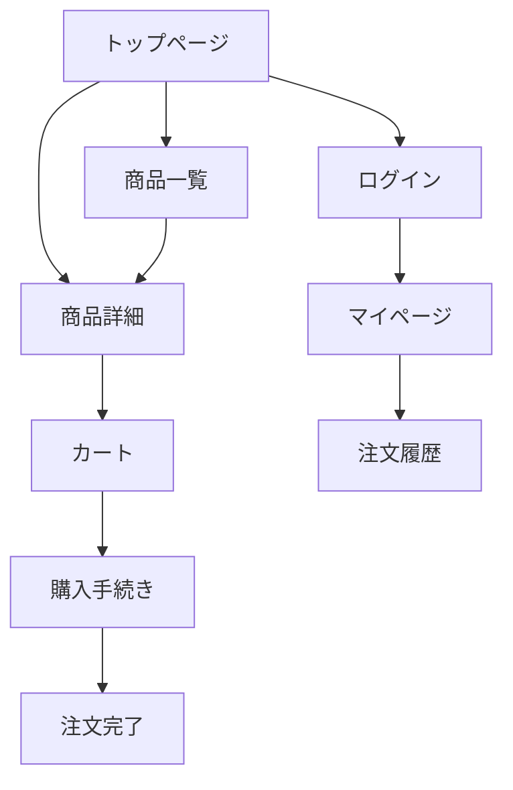

# 画面設計 作成ガイド

## 目次

1. [画面一覧 (screen-list.md)](#画面一覧)
2. [画面遷移図 (screen-transition.md)](#画面遷移図)
3. [個別画面定義](#個別画面定義)

## Smallテンプレートの場合

Smallテンプレートでは、画面一覧・画面遷移図・主要画面定義を **`screen-design.md`** 1ファイルに統合して記述する。

### 推奨構成

```markdown
# 画面設計

## 画面一覧

| 画面ID | 画面名 | 概要 | 認証 |
|--------|--------|------|------|
| SCR-C-001 | {画面名} | {概要} | 要/不要 |
| ... | ... | ... | ... |

## 画面遷移図

{Mermaid図: 主要な画面遷移フロー}

## 主要画面定義

### {画面名1}（SCR-C-001）
{レイアウト概要・構成要素・主要操作・対応API}

### {画面名2}（SCR-C-002）
{同様の構成}
```

### Fullとの主な差異

- 画面一覧・遷移図・主要画面定義を1ファイルにまとめる
- 個別画面定義は主要画面（5〜10画面程度）に絞る（全画面の詳細は不要）
- 画面定義の記述はレイアウト概要・構成要素・主要操作・対応APIに集中し、細かいバリデーションルール等は省略可
- 以下の各セクション別ガイドの内容を参考にしつつ、小規模プロジェクトに必要十分な粒度でまとめる

---

## 作成順序（Fullテンプレート）

screen-list.md → screen-transition.md → 個別画面定義 の順に作成する。
画面一覧で全画面を洗い出し、画面遷移図で画面間のフローを定義、その後各画面の詳細を定義する。

## 参照すべきドキュメント

- `docs/01-requirements/functional-requirements/` — 各機能の要件（画面に必要な機能の根拠）
- `docs/01-requirements/use-cases/` — ユースケース（画面遷移の根拠）
- `docs/01-requirements/business-requirements/business-flow.md` — 業務フロー
- `docs/02-technical-design/architecture/technology-stack.md` — フロントエンド技術スタック
- `docs/02-technical-design/security/authentication.md` — 認証方式（認証要否の根拠）

---

## 画面一覧

### 顧客向け画面一覧に含める内容

テーブル形式で全画面を一覧化する。

**一覧テーブルのフォーマット:**

※ 以下は記載例。プロジェクトの画面構成に応じて置き換えること。

| No | 画面ID | 画面名 | URL | 概要 | 認証要否 |
|----|--------|--------|-----|------|---------|
| 1 | SCR-C-001 | （例）トップページ | / | メインコンテンツ表示 | 不要 |
| 2 | SCR-C-002 | （例）一覧画面 | /items | 検索・フィルタ・一覧表示 | 不要 |

**画面ID体系:**
- 顧客向け: `SCR-C-XXX`（001から連番）
- 管理者向け: `SCR-A-XXX`（001から連番）

### 管理者向け画面一覧に含める内容

| No | 画面ID | 画面名 | URL | 概要 | 必要権限 |
|----|--------|--------|-----|------|---------|
| 1 | SCR-A-001 | ダッシュボード | /admin | 売上・注文サマリ | 管理者 |

### 品質基準

- 機能要件のすべての機能に対応する画面が存在すること
- ユースケースのすべてのシナリオが画面で実現可能であること
- 認証要否が機能要件・セキュリティ方式と整合していること

---

## 画面遷移図

### 顧客向け画面遷移図に含める内容

Mermaid記法で画面間の遷移を図示する。

**記載すべき項目:**
- 画面間の遷移（矢印）
- 遷移のトリガー（ボタンクリック、リンク等）
- 認証が必要な遷移（ログインへのリダイレクト）
- 条件分岐（ログイン状態による分岐等）

**Mermaid記法の例（ECサイトの場合）:**



※ 上記はECサイトの場合の一例。プロジェクトの画面構成に応じて適宜置き換えること。

### 管理者向け画面遷移図に含める内容

管理画面の遷移を同様にMermaid図で記載する。

**記載すべき項目:**
- サイドバーナビゲーションによる遷移
- CRUD操作のフロー（一覧→詳細→編集→確認→完了）
- モーダル・ドロワーによる遷移（ページ遷移ではないもの）

### 品質基準

- 画面一覧のすべての画面が遷移図に含まれていること
- ユースケースのメインフローが遷移図上で追跡可能であること
- 孤立した画面（到達不能な画面）がないこと

---

## 個別画面定義

各画面定義ファイルに以下の内容を記載する。

### 画面概要に含める内容

テーブル形式で画面の基本情報を記載する。

| 項目 | 内容 |
|------|------|
| 画面ID | SCR-C-XXX |
| 画面名 | 画面名称 |
| URL | /path/to/page |
| 認証要否 | 要 / 不要 |
| 対応機能要件 | FR-XXX |

### 画面レイアウトに含める内容

ASCII art またはMermaid図でワイヤーフレームレベルのレイアウトを記載する。

**記載する粒度:**
- ヘッダー / フッター / サイドバーの有無
- メインコンテンツのエリア分割
- 主要なUI要素の配置（ボタン、フォーム、リスト等）

**ASCII art ワイヤーフレームの例（ECサイトのトップページの場合）:**

```
+--------------------------------------------------+
| ヘッダー（ロゴ / 検索 / カート / ユーザーメニュー）|
+--------------------------------------------------+
| メインビジュアル（カルーセル）                       |
+--------------------------------------------------+
| カテゴリ一覧                                       |
| [カテゴリ1] [カテゴリ2] [カテゴリ3] [カテゴリ4]      |
+--------------------------------------------------+
| おすすめ商品                                       |
| [商品1] [商品2] [商品3] [商品4]                     |
+--------------------------------------------------+
| フッター（リンク / コピーライト）                    |
+--------------------------------------------------+
```

※ 上記はECサイトの場合の一例。デザインの詳細（色、フォント、余白等）は基本設計では扱わない。構造とコンテンツ配置が伝わるレベルで記載する。

### 表示要素に含める内容

テーブル形式で画面上の表示要素を一覧化する。

※ 以下は記載例。プロジェクトの画面要素に応じて置き換えること。

| No | 要素名 | 種類 | 表示内容 | 備考 |
|----|--------|------|---------|------|
| 1 | （例）メイン画像 | 画像 | 対象の画像 | 最大5枚、スライダー |
| 2 | （例）タイトル | テキスト | 対象の名称 | 最大100文字 |
| 3 | （例）数値情報 | テキスト | 金額・数量等 | フォーマット指定 |
| 4 | （例）アクションボタン | ボタン | — | 条件付き有効化 |

### 画面アクションに含める内容

ユーザー操作とシステムの応答を定義する。

※ 以下は記載例。プロジェクトの画面操作に応じて置き換えること。

| No | 操作 | 種類 | 処理内容 | 遷移先 | 備考 |
|----|------|------|---------|--------|------|
| 1 | （例）一覧項目クリック | タップ | 詳細取得API呼び出し | 詳細画面 | — |
| 2 | （例）アクションボタン | ボタン | 登録/更新API呼び出し | — | トースト通知表示 |
| 3 | （例）検索実行 | フォーム送信 | 検索API呼び出し | 一覧画面 | クエリパラメータ付与 |

### 入力フォームがある画面で追加する内容

フォームを持つ画面では以下も記載する：

**入力項目一覧:**

| No | 項目名 | 入力種別 | 必須 | バリデーション | 備考 |
|----|--------|---------|------|--------------|------|
| 1 | （例）メールアドレス | テキスト | 必須 | メール形式 | 最大255文字 |
| 2 | （例）パスワード | パスワード | 必須 | 8文字以上、英数記号 | 強度メーター表示 |

**バリデーションルール:**
- クライアントサイドバリデーション（即時フィードバック）
- サーバーサイドバリデーション（API側での検証）
- エラー表示方式（インライン / サマリ）

### レスポンシブ対応方針

画面ごとにレスポンシブ対応の方針を記載する。

| ブレークポイント | レイアウト変更 |
|----------------|--------------|
| デスクトップ（1024px以上） | フルレイアウト |
| タブレット（768px〜1023px） | 2カラム→1カラム |
| モバイル（767px以下） | 1カラム、ハンバーガーメニュー |

### 品質基準

- 画面一覧のすべての画面に個別画面定義が存在すること
- 表示要素がデータモデル（テーブル定義）と整合していること
- 画面アクションがAPI設計のエンドポイントと対応していること
- 入力バリデーションが機能要件のビジネスルールと整合していること
