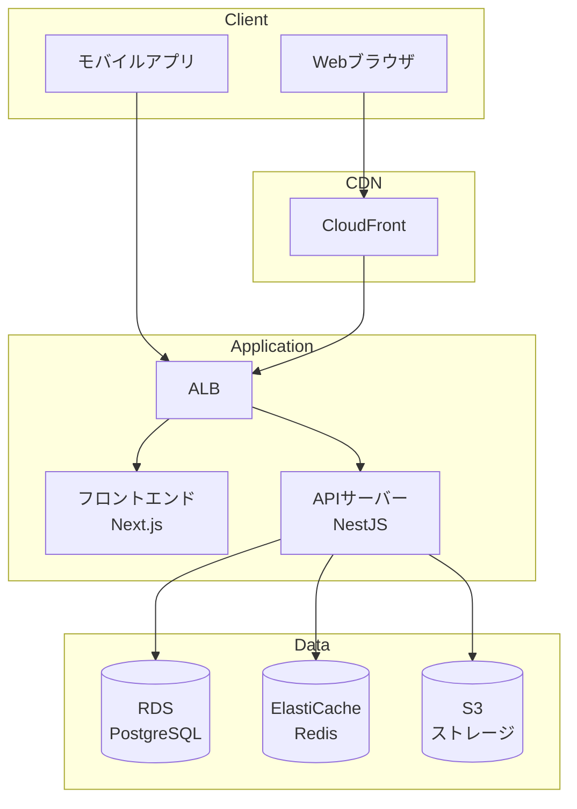
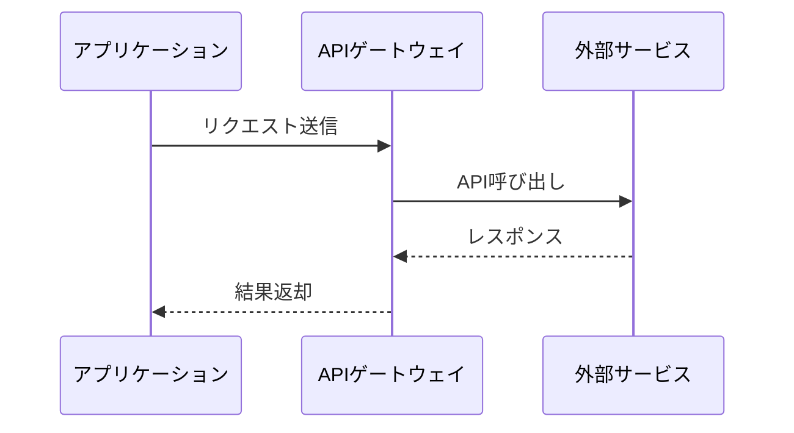

# システム構成 作成ガイド

## 目次

1. [システム全体像 (system-overview.md)](#システム全体像)
2. [モジュール構成 (module-structure.md)](#モジュール構成)
3. [外部インターフェース (external-interfaces.md)](#外部インターフェース)

## 作成順序

system-overview.md → module-structure.md → external-interfaces.md の順に作成する。
システム全体像で構成要素と配置を確定し、モジュール構成で内部の論理分割を定義、最後に外部システムとの連携仕様を詳細化する。

## 参照すべきドキュメント

- `docs/01-requirements/project-overview/scope.md` — システム境界の確認
- `docs/02-technical-design/architecture/architecture-pattern.md` — アーキテクチャパターンの方針
- `docs/02-technical-design/architecture/technology-stack.md` — 採用技術スタック
- `docs/02-technical-design/architecture/system-context.md` — 外部システム連携の概要
- `docs/02-technical-design/infrastructure/cloud-architecture.md` — インフラ構成

---

## システム全体像

### システム構成図に含める内容

方式設計で決定したアーキテクチャパターンと技術スタックに基づき、システムの物理的・論理的な構成を図示する。

**図に含める要素:**

- フロントエンド（Web/モバイル）
- APIゲートウェイ / ロードバランサー
- アプリケーションサーバー
- データベース（RDB、NoSQL、キャッシュ）
- 外部サービス連携
- CDN
- メッセージキュー（非同期処理がある場合）

**Mermaid記法の例:**



※ 上記はあくまで一例。方式設計の決定事項に基づいて適切な構成を図示すること。

### コンポーネント一覧に含める内容

テーブル形式で主要コンポーネントの役割を記載する。

| コンポーネント | 技術 | 役割 | 備考 |
|--------------|------|------|------|
| （例）フロントエンド | Next.js | SSR/CSR、UI描画 | Vercel or コンテナ |
| （例）APIサーバー | NestJS | ビジネスロジック、API提供 | コンテナ |
| （例）データベース | PostgreSQL | データ永続化 | RDS |
| （例）キャッシュ | Redis | セッション、APIキャッシュ | ElastiCache |

### 通信フローに含める内容

主要な業務シナリオにおけるコンポーネント間の通信フローを図示する。

**推奨シナリオ:**
- ページ表示フロー（SSR / CSR）
- API呼び出しフロー（認証あり / なし）
- 非同期処理フロー（ある場合）

**記載すべき項目:**
- プロトコル（HTTPS、WebSocket等）
- 認証方式の適用ポイント
- キャッシュの介在ポイント

### 品質基準

- 方式設計のアーキテクチャ図との整合性があること
- すべてのコンポーネントが一覧テーブルに記載されていること
- 主要な通信フローがMermaidで図示されていること

---

## モジュール構成

### フロントエンドモジュールに含める内容

フロントエンドの論理的なモジュール分割を定義する。

**一般的な構成:**

```
frontend/
├── pages/          # ページコンポーネント（ルーティング）
├── features/       # 機能モジュール（ドメイン単位）
├── components/     # 共通UIコンポーネント
├── hooks/          # カスタムフック
├── stores/         # 状態管理
├── libs/           # ユーティリティ・ヘルパー
├── types/          # 型定義
└── styles/         # グローバルスタイル
```

**記載すべき項目:**
- モジュール分割の方針（機能ベース / レイヤーベース）
- 各モジュールの責務と含まれる画面・コンポーネント
- モジュール間の依存ルール

### バックエンドモジュールに含める内容

バックエンドの論理的なモジュール分割を定義する。

**一般的な構成（ドメイン駆動設計の場合）:**

```
backend/
├── modules/
│   ├── auth/               # 認証モジュール
│   ├── user/               # ユーザー管理モジュール
│   ├── {ドメインモジュール}/ # 業務ドメインごとに1モジュール
│   │                        # （プロジェクトに応じて増減）
│   └── ...
├── common/                 # 共通処理
├── config/                 # 設定
└── infrastructure/         # インフラ層（DB、外部API）
```

※ モジュール分割はプロジェクトのドメインに応じて決定する。機能要件の各機能モジュールとの対応を明確にすること。

**記載すべき項目:**
- モジュール分割の方針（ドメインベース / 機能ベース）
- 各モジュールの責務
- モジュール内の構造（Controller / Service / Repository 等）

### 共通モジュールに含める内容

**記載すべき項目:**
- 認証・認可ミドルウェア
- バリデーション
- エラーハンドリング
- ロギング
- 共通DTO / レスポンス形式

### モジュール間依存関係に含める内容

Mermaid図でモジュール間の依存関係を図示する。

**記載すべき項目:**
- 許可される依存の方向
- 禁止される循環依存
- 共通モジュールへの依存ルール

### 品質基準

- 機能要件の各機能がいずれかのモジュールに対応していること
- モジュール間の依存方向が明確であること
- 共通処理が適切に分離されていること

---

## 外部インターフェース

### 外部システム連携一覧に含める内容

方式設計のシステムコンテキスト図を具体化し、各外部システムとの連携仕様を詳細に定義する。

**一覧テーブルのフォーマット:**

※ 以下はECサイトの場合の一例。プロジェクトの外部連携先に応じて適宜置き換えること。

| No | 連携先 | 連携方式 | 通信方向 | データ形式 | 認証方式 | 備考 |
|----|--------|---------|---------|-----------|---------|------|
| 1 | （例）決済サービス | REST API | 双方向 | JSON | APIキー | PCI DSS準拠 |
| 2 | （例）配送サービス | REST API | 送信 | JSON | OAuth2 | Webhook受信あり |
| 3 | （例）メール配信 | REST API | 送信 | JSON | APIキー | テンプレート管理 |

### 各連携先の詳細仕様に含める内容

連携先ごとに以下を記載する：

**記載すべき項目:**
- 連携先サービスの概要（利用サービス名、バージョン）
- 連携データ（送信 / 受信それぞれ）
- API呼び出しパターン（同期 / 非同期）
- エラーハンドリング（リトライ方針、タイムアウト設定）
- 制限事項（レート制限、データサイズ上限）
- テスト環境（サンドボックスの有無）

**連携シーケンス図の例:**



### 品質基準

- 方式設計のシステムコンテキスト図に含まれるすべての外部システムが網羅されていること
- 各連携先のエラーハンドリング方針が定義されていること
- 認証方式とセキュリティ要件が明記されていること
