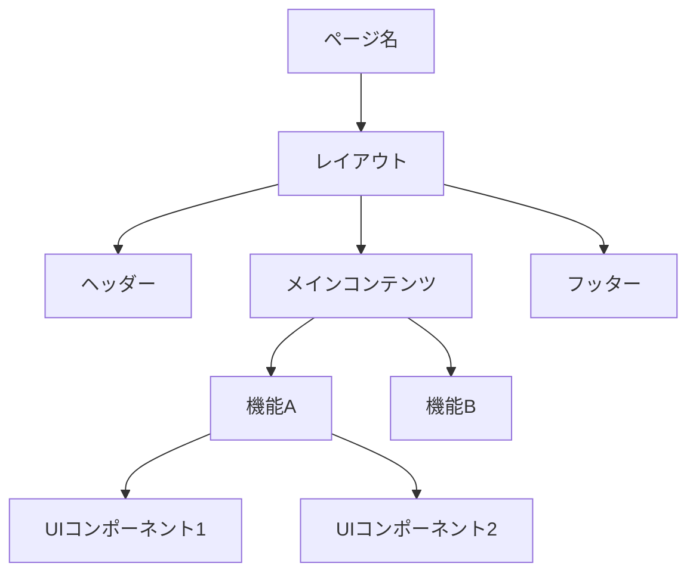
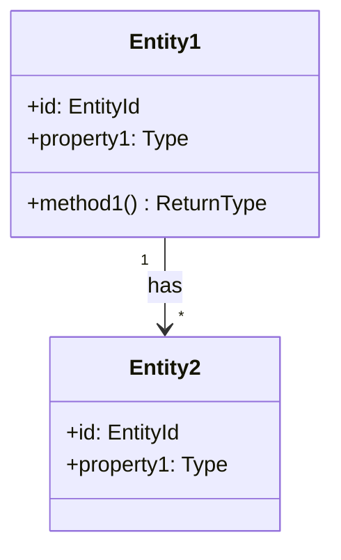

# コンポーネント設計 作成ガイド

## 目次

1. [フロントエンド設計](#フロントエンド設計)
   - [コンポーネントツリー (component-tree.md)](#コンポーネントツリー)
   - [状態管理 (state-management.md)](#状態管理)
   - [ルーティング (routing.md)](#ルーティング)
2. [バックエンド設計](#バックエンド設計)
   - [ドメインモデル (domain-model.md)](#ドメインモデル)
   - [サービス層 (service-layer.md)](#サービス層)
   - [リポジトリ層 (repository-layer.md)](#リポジトリ層)

## Smallテンプレートの場合

Smallテンプレートでは、FE/BEのコンポーネント設計を **`component-design.md`** 1ファイルに統合して記述する。

### 推奨構成

```markdown
# コンポーネント設計

## フロントエンド

### コンポーネント構成
{主要ページコンポーネントの一覧テーブル}

| コンポーネント | 種別 | 責務 | 対応画面 |
|--------------|------|------|----------|
| {名前} | Page | {責務} | SCR-C-001 |
| ... | ... | ... | ... |

### ルーティング
{主要ルート定義テーブル}

### 状態管理方針
{グローバル状態・ローカル状態の方針を簡潔に記述}

## バックエンド

### サービス一覧

| サービス | 責務 | 対応API |
|---------|------|---------|
| {名前} | {責務} | API-C-001 |
| ... | ... | ... |

### ドメインモデル概要
{主要エンティティと値オブジェクトの一覧}

### リポジトリ一覧

| リポジトリ | 対象テーブル | 主要メソッド |
|-----------|-------------|-------------|
| {名前} | TBL-001 | findById, save, delete |
| ... | ... | ... |
```

### Fullとの主な差異

- FE（3ファイル）+ BE（3ファイル）を1ファイルのFE/BEセクションとして統合
- コンポーネントツリーの詳細図は省略し、一覧テーブルで主要コンポーネントを列挙
- 状態管理は方針の概要のみ（ストアの詳細設計は省略可）
- ドメインモデルのクラス図は簡略化し、主要エンティティの一覧で代替可
- 以下の各セクション別ガイドの内容を参考にしつつ、小規模プロジェクトに必要十分な粒度でまとめる

---

## 作成順序（Fullテンプレート）

**フロントエンド:** component-tree.md → state-management.md → routing.md の順に作成する。
コンポーネントツリーで画面の構成要素を確定し、状態管理で各コンポーネントのデータフローを定義、ルーティングでページ遷移構造を確定する。

**バックエンド:** domain-model.md → service-layer.md → repository-layer.md の順に作成する。
ドメインモデルでビジネスロジックの中核を確定し、サービス層でユースケースの実行単位を定義、リポジトリ層でデータアクセスの抽象化を確定する。

フロントエンド・バックエンドの作成順序は問わないが、API設計との整合性確認のためバックエンド → フロントエンドの順を推奨する。

## 参照すべきドキュメント

- `docs/02-technical-design/architecture/architecture-pattern.md` — アーキテクチャパターンの方針
- `docs/02-technical-design/architecture/technology-stack.md` — 採用技術スタック（FE/BEフレームワーク）
- `docs/03-basic-design/system-architecture/module-structure.md` — モジュール構成
- `docs/03-basic-design/screen-design/screen-list.md` — 画面一覧
- `docs/03-basic-design/screen-design/` — 各画面定義（コンポーネント分割の根拠）
- `docs/03-basic-design/data-model/er-diagram.md` — ER図（ドメインモデルの根拠）
- `docs/03-basic-design/data-model/table-definitions/` — テーブル定義（リポジトリ層の根拠）
- `docs/03-basic-design/api-design/api-overview.md` — API設計方針（サービス層の根拠）

---

## フロントエンド設計

### コンポーネントツリー

#### コンポーネント分類に含める内容

コンポーネントを役割に応じて分類し、各分類の責務を定義する。

**一般的な分類体系:**

| 分類 | 責務 | 状態保持 | 例 |
|------|------|---------|-----|
| Page | ルーティング単位、データ取得、レイアウト構成 | あり | トップページ、検索結果ページ |
| Feature | 業務機能を実現する複合コンポーネント | あり | ヘッダー、商品カード一覧、カートサイドバー |
| UI | 再利用可能なプレゼンテーションコンポーネント | なし（propsのみ） | ボタン、入力フィールド、モーダル |
| Layout | 画面レイアウトの構造を定義 | 最小限 | メインレイアウト、認証レイアウト |

※ 分類体系はプロジェクトの技術スタック・チーム規模に応じて調整すること。

#### コンポーネントツリー図に含める内容

各画面のコンポーネント階層をツリー形式で図示する。

**記載フォーマット（Mermaid）:**



※ 上記はあくまで構造の例。各画面定義に基づいて具体的なコンポーネントツリーを作成すること。

#### コンポーネント一覧に含める内容

各コンポーネントの仕様を一覧テーブルで記載する。

| ID | コンポーネント名 | 分類 | 責務 | Props | 状態 | 対応画面 |
|----|----------------|------|------|-------|------|---------|
| CMP-PAGE-001 | （例）TopPage | Page | トップ画面の表示 | — | 商品一覧データ | SCR-C-001 |
| CMP-UI-001 | （例）Button | UI | 汎用ボタン | label, onClick, variant | — | 共通 |

※ 「対応画面」は基本設計の画面IDを参照し、トレーサビリティを確保する。

#### 共通コンポーネントカタログに含める内容

プロジェクト全体で再利用するUIコンポーネントを定義する。

**各コンポーネントの記載項目:**

- コンポーネント名と責務
- Props定義（型、必須/任意、デフォルト値）
- バリアント（ボタンなら primary / secondary / danger 等）
- 使用例

**Props定義のフォーマット:**

| Prop | 型 | 必須 | デフォルト | 説明 |
|------|-----|------|-----------|------|
| label | string | 必須 | — | 表示テキスト |
| variant | 'primary' \| 'secondary' | 任意 | 'primary' | ボタンの種類 |
| disabled | boolean | 任意 | false | 非活性状態 |
| onClick | () => void | 必須 | — | クリック時のハンドラ |

#### 品質基準

- 基本設計の全画面がいずれかのPageコンポーネントに対応していること
- コンポーネントの責務が単一責任原則に従っていること
- 共通コンポーネントのPropsが型安全に定義されていること
- コンポーネント間の依存方向が明確であること（UI → Feature → Page の逆依存がないこと）

---

### 状態管理

#### 状態の分類に含める内容

アプリケーションの状態を種類別に分類し、管理方針を定義する。

**一般的な分類:**

| 種類 | スコープ | 管理手法 | 例 |
|------|---------|---------|-----|
| サーバー状態 | グローバル | データフェッチライブラリ（TanStack Query等） | API取得データ、キャッシュ |
| グローバルUI状態 | グローバル | 状態管理ライブラリ（Zustand等） | 認証情報、テーマ、通知 |
| ローカルUI状態 | コンポーネント | useState / useReducer | フォーム入力、モーダル開閉 |
| URL状態 | グローバル | ルーターパラメータ | 検索条件、ページ番号、ソート |

※ 管理手法は方式設計の技術スタックに応じて決定する。

#### Store設計に含める内容

グローバル状態を管理するStoreの構成を定義する。

**各Storeの記載項目:**

- Store名と管理対象
- 状態（State）のフィールド定義
- アクション（Actions）の定義
- 他のStoreとの依存関係

**記載フォーマット:**

```markdown
### AuthStore（認証ストア）

**状態:**

| フィールド | 型 | 初期値 | 説明 |
|-----------|-----|--------|------|
| user | User | null | ログインユーザー情報 |
| isAuthenticated | boolean | false | 認証状態 |
| token | string | null | アクセストークン |

**アクション:**

| アクション | 引数 | 説明 |
|-----------|------|------|
| login | credentials: LoginInput | ログイン処理・トークン保存 |
| logout | — | ログアウト処理・状態クリア |
| refreshToken | — | トークンリフレッシュ |
```

※ 上記は認証の例。プロジェクトの要件に応じて必要なStoreを定義すること。

#### データフェッチ戦略に含める内容

サーバー状態の取得・更新パターンを定義する。

**記載すべき項目:**
- キャッシュ方針（staleTime、gcTime等）
- 楽観的更新（Optimistic Update）の適用範囲
- エラーリトライ方針
- ページネーション・無限スクロールのデータ取得パターン
- リアルタイム更新の仕組み（必要な場合）

#### 品質基準

- 状態の種類ごとに適切な管理手法が選定されていること
- グローバル状態が必要最小限に抑えられていること
- Store間の循環依存がないこと
- データフェッチのキャッシュ戦略が非機能要件（性能）と整合していること

---

### ルーティング

#### ルート定義に含める内容

アプリケーションのルーティング構成を定義する。

**ルート一覧のフォーマット:**

| パス | ページコンポーネント | 認証 | レイアウト | 対応画面ID |
|------|-------------------|------|----------|-----------|
| / | TopPage | 不要 | MainLayout | SCR-C-001 |
| /login | LoginPage | 不要 | AuthLayout | SCR-C-002 |
| /mypage | MyPage | 必要 | MainLayout | SCR-C-003 |
| /admin/* | AdminDashboard | 必要（管理者） | AdminLayout | SCR-A-001 |

※ パスとページコンポーネントの対応はプロジェクトの画面一覧に基づいて定義する。

#### ルートガード（認証・認可制御）に含める内容

**記載すべき項目:**
- 未認証ユーザーのリダイレクト先
- 権限不足時の表示（403ページ等）
- 認証チェックのタイミング（ルート遷移前 / レンダリング時）
- トークン有効期限切れ時の挙動

#### 動的ルーティングに含める内容

**記載すべき項目:**
- 動的パラメータの定義（`:id` 等）
- クエリパラメータの管理方針
- ネストルートの構成
- 404ページの表示条件

#### 品質基準

- 基本設計の画面遷移図と整合していること
- 全画面に対応するルートが定義されていること
- 認証・認可の制御が方式設計のセキュリティ方式と整合していること

---

## バックエンド設計

### ドメインモデル

#### エンティティ定義に含める内容

ビジネスドメインの中核となるエンティティを定義する。基本設計のER図・テーブル定義をもとに、ビジネスロジックを含むドメインオブジェクトとして再設計する。

**各エンティティの記載項目:**

- エンティティ名と責務
- プロパティ（属性）定義
- ビジネスルール（不変条件）
- 振る舞い（メソッド）

**記載フォーマット:**

```markdown
### User（ユーザー）

**ID:** DOM-001
**対応テーブル:** TBL-001（users）

**プロパティ:**

| プロパティ | 型 | 説明 | 不変条件 |
|-----------|-----|------|---------|
| id | UserId | ユーザー識別子 | UUID形式 |
| email | Email | メールアドレス | 一意、メール形式 |
| name | UserName | 表示名 | 1〜50文字 |
| status | UserStatus | アカウント状態 | ACTIVE / SUSPENDED / WITHDRAWN |

**ビジネスルール:**

- メールアドレスはシステム内で一意
- 退会済みユーザーは再登録不可

**メソッド:**

| メソッド | 引数 | 戻り値 | 説明 |
|---------|------|--------|------|
| changeEmail | newEmail: Email | void | メールアドレス変更（重複チェック必要） |
| suspend | reason: string | void | アカウント停止 |
| withdraw | — | void | 退会処理（ステータス変更） |
```

※ 上記はユーザーエンティティの例。プロジェクトのドメインに応じて定義すること。

#### 値オブジェクト定義に含める内容

ドメイン固有の値の型を定義する。

**記載すべき項目:**
- 値オブジェクト名と責務
- バリデーションルール
- 等価性の判定基準
- ファクトリメソッド（生成ルール）

**一般的な値オブジェクトの例:**

| 値オブジェクト | 内部型 | バリデーション | 用途 |
|--------------|--------|--------------|------|
| Email | string | メール形式、255文字以内 | メールアドレス表現 |
| Money | { amount: number, currency: string } | amount >= 0 | 金額表現 |
| DateRange | { start: Date, end: Date } | start <= end | 期間表現 |

※ 値オブジェクトはプロジェクトのドメインに応じて必要なものを定義する。

#### ドメインイベントに含める内容（必要な場合）

ドメインの重要な状態変化をイベントとして定義する。

**記載すべき項目:**
- イベント名と発生条件
- ペイロード（イベントに含まれるデータ）
- 購読者（イベントを処理するハンドラ）

#### クラス図に含める内容

Mermaidのクラス図でエンティティ間の関連を図示する。



※ 上記は構造の例。ER図に基づき、ドメインモデルとしての関連を図示すること。

#### 品質基準

- 基本設計のER図の全エンティティがドメインモデルに対応していること
- ビジネスルールがドメインモデル内に集約されていること（貧血ドメインモデルの回避）
- エンティティの不変条件が明確に定義されていること
- 値オブジェクトにより型安全が確保されていること

---

### サービス層

#### サービス設計に含める内容

ユースケースの実行単位としてサービスクラスを定義する。基本設計のAPI仕様に対応するビジネスロジックの実行を担当する。

**各サービスの記載項目:**

- サービス名と責務
- 依存するリポジトリ・外部サービス
- 公開メソッド（ユースケース単位）
- トランザクション境界

**記載フォーマット:**

```markdown
### UserService（ユーザーサービス）

**ID:** SVC-001
**責務:** ユーザーに関するユースケースの実行
**対応API:** API-C-001（認証API）

**依存:**
- UserRepository
- EmailService（外部）
- PasswordHasher

**メソッド:**

| メソッド | 引数 | 戻り値 | トランザクション | 説明 |
|---------|------|--------|----------------|------|
| register | input: RegisterInput | User | 必要 | 新規ユーザー登録 |
| login | input: LoginInput | AuthToken | 不要 | ログイン認証 |
| updateProfile | userId, input: ProfileInput | User | 必要 | プロフィール更新 |
```

※ 上記はユーザーサービスの例。プロジェクトのAPIに応じてサービスを定義すること。

#### サービスメソッド詳細に含める内容

主要なメソッドについて処理フローを記載する。

**記載すべき項目:**
- 前提条件（事前チェック）
- 処理ステップ（番号付きリスト）
- 発生しうるエラー（エラーコード参照）
- 後続処理（イベント発行、通知等）

#### 横断的関心事に含める内容

**記載すべき項目:**
- 認証・認可チェックの実行タイミング
- バリデーションの実行方式
- ロギングの方針（何をログに残すか）
- パフォーマンス考慮（N+1問題の回避方針等）

#### 品質基準

- 基本設計の全API仕様に対応するサービスメソッドが定義されていること
- サービス層にドメインロジックが漏れ出していないこと（ドメインモデルに委譲）
- トランザクション境界が明確に定義されていること
- エラーケースが網羅されていること

---

### リポジトリ層

#### リポジトリ設計に含める内容

データアクセスを抽象化するリポジトリを定義する。基本設計のテーブル定義に対応するCRUD操作を提供する。

**各リポジトリの記載項目:**

- リポジトリ名と管理対象エンティティ
- インターフェース定義（公開メソッド）
- クエリ仕様（検索条件の定義方式）

**記載フォーマット:**

```markdown
### UserRepository

**ID:** REP-001
**管理対象:** User エンティティ（DOM-001）
**対応テーブル:** TBL-001（users）

**インターフェース:**

| メソッド | 引数 | 戻り値 | 説明 |
|---------|------|--------|------|
| findById | id: UserId | User \| null | IDによる取得 |
| findByEmail | email: Email | User \| null | メールアドレスによる取得 |
| findAll | criteria: UserCriteria, pagination | PaginatedResult<User> | 条件付き一覧取得 |
| save | user: User | User | 作成・更新 |
| delete | id: UserId | void | 削除 |
```

※ 上記はユーザーリポジトリの例。各エンティティに対応するリポジトリを定義すること。

#### クエリ仕様（Criteria）に含める内容

検索条件をオブジェクトとして定義する。

**記載すべき項目:**
- フィルタ条件（等値、範囲、部分一致等）
- ソート条件
- ページネーション

#### キャッシュ戦略に含める内容

リポジトリレベルでのキャッシュ適用方針を定義する。

**記載すべき項目:**
- キャッシュ対象（頻繁に読み取られるデータ）
- キャッシュ無効化の条件
- TTL設定
- 方式設計のキャッシュ戦略との整合性

#### 品質基準

- 基本設計の全テーブルに対応するリポジトリが定義されていること
- リポジトリのインターフェースがドメインモデルの言葉で定義されていること（SQLの詳細が漏れていないこと）
- 検索条件が基本設計のAPI仕様のフィルタ条件と整合していること
- キャッシュ戦略が方式設計のデータ方式と整合していること
