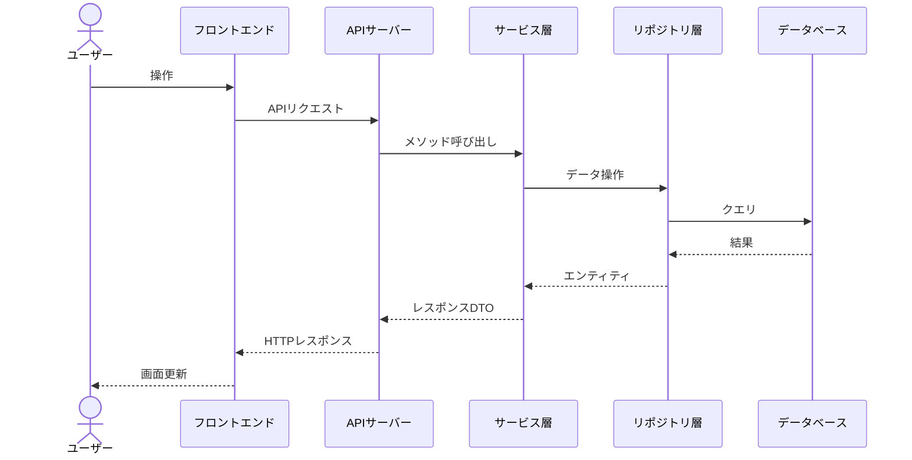
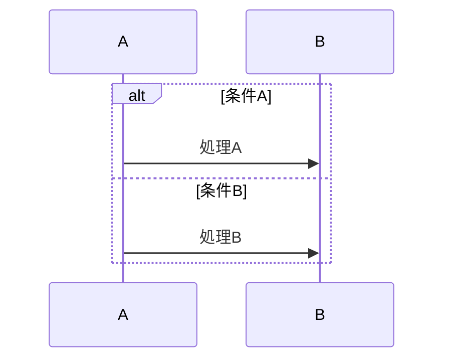
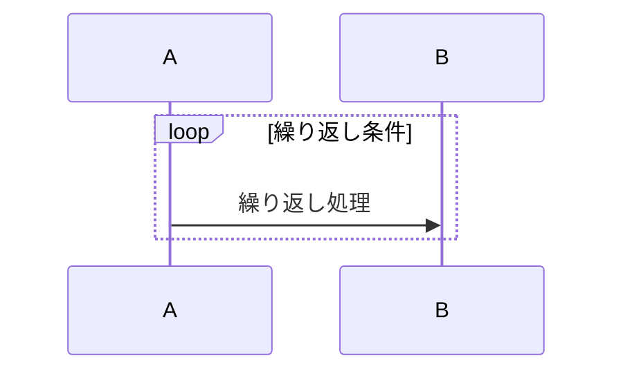
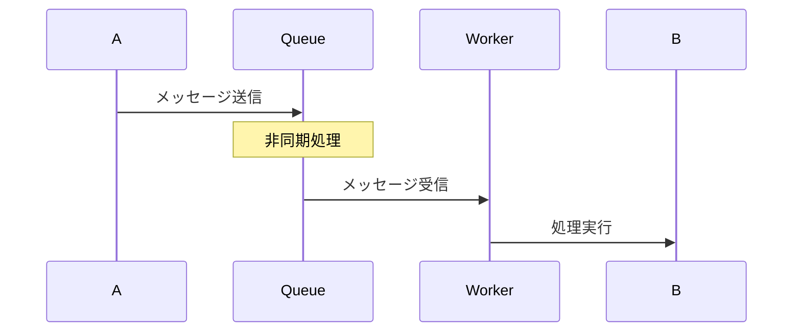
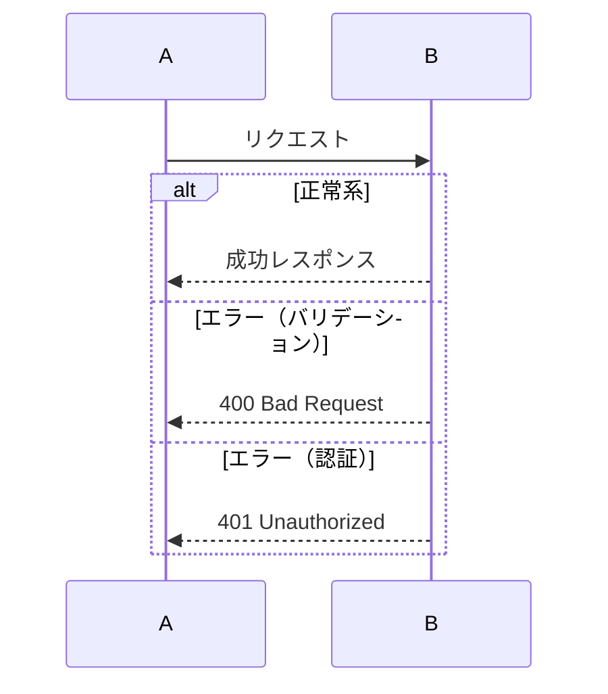
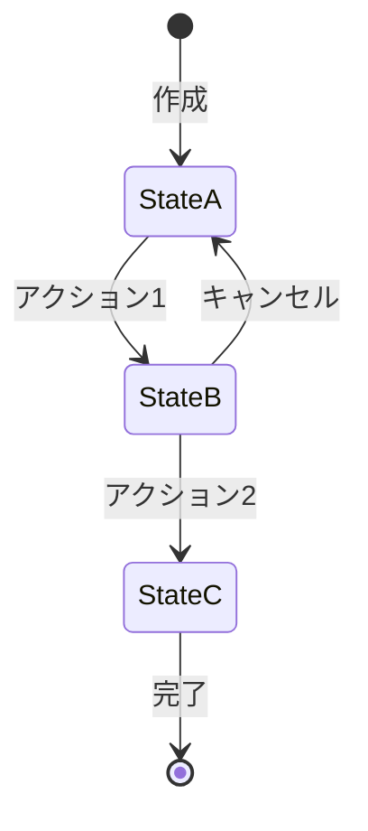

# シーケンス図 作成ガイド

## 目次

1. [シーケンス図の作成方針](#シーケンス図の作成方針)
2. [業務フロー別シーケンス図](#業務フロー別シーケンス図)

## 作成順序

プロジェクトの主要業務フローを特定し、重要度の高いものから順に作成する。
一般的なWebアプリケーションでは、認証フローを最初に作成し、次にメインの業務フロー、最後に補助的なフローを作成する。

**フロー特定の基準:**

1. ユーザーの中核的な業務フロー（基本設計のユースケースに基づく）
2. 複数コンポーネントが連携する複雑なフロー
3. 外部サービスとの連携を含むフロー
4. トランザクション管理が必要なフロー

**一般的なWebアプリケーションでの典型的なフロー:**

- 認証フロー（ログイン / ログアウト / トークンリフレッシュ）
- メイン業務フロー（プロジェクトの主要ユースケース）
- 決済・課金フロー（該当する場合）
- 状態遷移フロー（複雑な状態管理がある場合）

※ 具体的なフローはプロジェクトのユースケースと基本設計の内容に基づいて決定すること。

## 参照すべきドキュメント

- `docs/01-requirements/use-cases/` — ユースケース定義（フローの根拠）
- `docs/03-basic-design/system-architecture/system-overview.md` — システム全体像（参加者の特定）
- `docs/03-basic-design/screen-design/` — 画面定義（UIアクションの特定）
- `docs/03-basic-design/api-design/` — API仕様（API呼び出しの詳細）
- `docs/03-basic-design/batch-design/` — バッチ定義（バッチ処理フローの根拠）
- `docs/02-technical-design/security/authentication.md` — 認証方式（認証フローの根拠）
- `docs/02-technical-design/security/authorization.md` — 認可方式（認可チェックのポイント）

---

## シーケンス図の作成方針

### 参加者（Participant）の定義

シーケンス図に登場する参加者は、コンポーネント設計で定義した構成要素に基づく。

**一般的な参加者:**

| 参加者 | 役割 | 記載レベル |
|--------|------|-----------|
| ユーザー | 操作の起点 | Actor |
| フロントエンド | UI操作・表示 | コンポーネント単位またはページ単位 |
| APIゲートウェイ | 認証・ルーティング | ミドルウェアレベル |
| サービス層 | ビジネスロジック実行 | サービスクラス単位 |
| リポジトリ層 | データアクセス | リポジトリ単位 |
| データベース | データ永続化 | DB種別単位 |
| 外部サービス | 外部連携 | サービス単位 |
| メッセージキュー | 非同期処理 | キュー単位 |

※ 参加者の粒度はフローの複雑さに応じて調整する。単純なフローでは抽象度を上げ、複雑なフローでは具体的にする。

### Mermaid記法の標準パターン

#### 基本構造

#### 条件分岐

#### ループ処理

#### 非同期処理

#### エラーハンドリング

### 各シーケンス図ファイルに含める内容

**1. 概要**
- フローの目的
- 対応するユースケースID
- 前提条件（認証状態等）

**2. 参加者一覧**

| 参加者 | 説明 | 対応コンポーネント |
|--------|------|------------------|
| （参加者名） | （役割） | （コンポーネント設計のID） |

**3. 正常系シーケンス図**
- メインフローをMermaidで図示
- 主要なステップに番号を付与
- データの変換ポイントを明記

**4. 代替フロー（該当する場合）**
- キャッシュヒット時のショートカットフロー
- 条件分岐による別経路

**5. 異常系シーケンス図**
- 主要なエラーケースをMermaidで図示
- エラーコード（error-code-list.md 参照）を明記
- リトライ・フォールバックの挙動

**6. 処理ステップ詳細**

テーブル形式で各ステップの詳細を記載する。

| ステップ | 処理 | 入力 | 出力 | エラー条件 |
|---------|------|------|------|-----------|
| 1 | （処理内容） | （入力データ） | （出力データ） | （エラーとなる条件） |

---

## 業務フロー別シーケンス図

### 認証フロー

認証フローは多くのWebアプリケーションで共通して必要となるフローである。

**含めるべきサブフロー:**

| サブフロー | 説明 | 関連API |
|-----------|------|---------|
| ログイン | 認証情報の検証・トークン発行 | 認証API |
| トークンリフレッシュ | アクセストークンの再発行 | 認証API |
| ログアウト | セッション無効化・トークン破棄 | 認証API |

**認証フロー固有の考慮事項:**
- トークンの保存場所（Cookie / LocalStorage）
- リフレッシュトークンのローテーション
- 同時ログインの制御
- セッションタイムアウトの処理

### メイン業務フロー

プロジェクトの主要な業務フローを、ユースケース定義に基づいてシーケンス図にする。

**メイン業務フロー固有の考慮事項:**
- トランザクション境界（どこからどこまでが1トランザクションか）
- 外部サービス呼び出しのタイミングと失敗時の挙動
- 在庫確認・排他制御など、同時実行制御が必要なポイント
- 楽観的ロック / 悲観的ロックの適用箇所

### 決済・課金フロー（該当する場合）

決済を含むプロジェクトでは、決済サービスとの連携フローを定義する。

**決済フロー固有の考慮事項:**
- 決済処理のステータス遷移
- 冪等性の確保（二重課金防止）
- タイムアウト時の処理
- 返金・キャンセル処理

### 状態遷移フロー（該当する場合）

複雑な状態管理が必要なリソースの状態遷移をシーケンス図で表現する。

**記載すべき項目:**
- 状態遷移図（Mermaid stateDiagram）
- 各遷移のトリガーとなるアクション
- 遷移時のバリデーション
- 遷移不可能なケースのエラーハンドリング

**状態遷移図の例:**

※ 上記はあくまで構造の例。プロジェクトのドメインに応じて適切な状態遷移を定義すること。

## 品質基準（共通）

- ユースケース定義の基本フロー・代替フロー・例外フローが網羅されていること
- 参加者がコンポーネント設計と整合していること
- API呼び出しが基本設計のAPI仕様と整合していること
- エラーケースがエラーハンドリング設計と整合していること
- トランザクション境界が明確に示されていること
- 外部サービス呼び出しの失敗時の挙動が定義されていること
