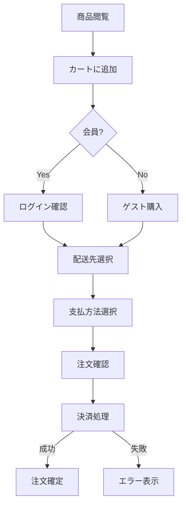

# ビジネス要件セクション 作成ガイド

## 目次

1. [業務フロー (business-flow.md)](#業務フロー)
2. [ビジネスルール (business-rules.md)](#ビジネスルール)
3. [KPI・目標指標 (kpi.md)](#kpi目標指標)

## 作成順序

business-flow.md → business-rules.md → kpi.md の順に作成する。
業務の流れを可視化してからルールを定義し、最後にKPIで測定基準を設定する。

---

## 業務フロー

### 記述対象フロー

対象システムの主要業務フローを網羅する。プロジェクトのドメインに応じて洗い出すこと。

**ECサイトの場合の例:**

1. **顧客購買フロー**: 商品閲覧 → カート追加 → 購入手続き → 決済 → 配送 → 受取
2. **商品管理フロー**: 商品登録 → 公開設定 → 在庫管理 → 販売終了
3. **注文管理フロー**: 注文受付 → 確認 → 出荷準備 → 出荷 → 配送 → 完了
4. **返品・交換フロー**: 申請 → 受付 → 検品 → 返金 or 交換

**SaaSの場合の例:**

1. **ユーザーオンボーディング**: サインアップ → プラン選択 → 初期設定 → 利用開始
2. **サブスクリプション管理**: 契約 → 利用 → 更新/変更 → 解約
3. **サポートフロー**: 問い合わせ → 受付 → 対応 → 解決 → クローズ

### 記述方法

- Mermaid記法のフローチャートを使用する
- 正常系と異常系の両方を記述する
- アクター（顧客/管理者/システム）ごとのレーンを分ける
- 各ステップで発生するデータ・通知を明記する

### Mermaid記述例

**例: ECサイトの購買フロー**

プロジェクトのドメインに合わせてフロー図を作成すること。

### 品質基準

- すべての業務フローに開始・終了条件があること
- 例外フローが記述されていること
- システム境界（人手 vs 自動）が明確であること

---

## ビジネスルール

### カテゴリ別記述項目

プロジェクトのドメインに応じてカテゴリを洗い出す。以下は代表的な分類と、ECサイトの場合の具体例を示す。

#### 料金・課金ルール
- 料金体系（固定/従量/サブスクリプション 等）
- 割引・プロモーションの適用ルール
- 例: EC → 定価設定、セール、クーポン、ポイント利用

#### リソース管理ルール
- 管理対象リソースの定義と単位
- リソースの状態遷移（利用可能/予約済/消費済 等）
- 例: EC → SKU管理、在庫引当タイミング、バックオーダー可否

#### サービス提供ルール
- サービスの提供方法・条件
- SLA（サービスレベル合意）
- 例: EC → 配送方法、送料計算、日時指定

#### キャンセル・返品ルール
- キャンセル/返品の可否条件
- 返金方法・処理期間
- 例: EC → 返品期間、返品不可商品、交換時の差額処理

#### 会員・権限ルール
- 会員種別・ランクの定義
- 特典・優遇条件
- 例: EC → ポイント付与率、会員ランク判定基準

### 記述フォーマット

各ルールは以下の形式で記述：

- **ルールID**: BR-XXX
- **ルール名**: 簡潔な名称
- **条件**: ルールが適用される条件
- **アクション**: 条件を満たした場合の処理
- **例外**: ルールの例外ケース

### 品質基準

- ルール間の矛盾がないこと
- 優先順位が明確であること（複数ルール競合時）
- ビジネス判断が必要な箇所に「要確認」マークがあること

---

## KPI・目標指標

### ビジネスKPI

プロジェクトの事業目標に応じて定義する。以下はテーブルフォーマットの例：

| KPI | 定義 | 目標値 | 測定方法 |
|-----|------|--------|----------|
| {主要収益指標} | {定義} | X | {測定方法} |
| {コンバージョン指標} | {定義} | X% | {測定方法} |
| {顧客単価指標} | {定義} | X円 | {測定方法} |
| {継続率指標} | {定義} | X% | {測定方法} |

**ECサイトの例:** 月間売上高、コンバージョン率、客単価、リピート率
**SaaSの例:** MRR、チャーンレート、ARPU、LTV

### システムKPI

| KPI | 定義 | 目標値 |
|-----|------|--------|
| ページ表示速度 | 主要ページのロード時間 | Xs以内 |
| システム稼働率 | 月間稼働率 | 99.X% |
| エラー率 | エラー数 / 全リクエスト数 | X%未満 |

### UX KPI

| KPI | 定義 | 目標値 |
|-----|------|--------|
| NPS | Net Promoter Score | Xポイント以上 |
| タスク完了率 | 主要タスクの完了率 | X%以上 |
| 離脱率 | 重要フロー途中の離脱率 | X%未満 |

### 品質基準

- すべてのKPIに測定方法が定義されていること
- 目標値に根拠（ベンチマーク or 現状値からの改善率）があること
- 測定頻度が明記されていること
