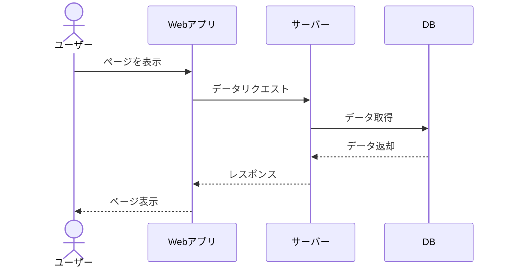

# ユースケースセクション 作成ガイド

## 目次

1. [共通の記述方針](#共通の記述方針)
2. [カスタマーユースケース](#カスタマーユースケース)
3. [管理者ユースケース](#管理者ユースケース)

## 共通の記述方針

### ユースケースの記述テンプレート

```markdown
# ユースケース: {名前}

## 概要
{1〜2文でユースケースの目的を説明}

## アクター
- {主アクター}（{補足：会員/非会員/権限レベル等}）

## 事前条件
- {ユースケース開始に必要な条件を箇条書きで列挙}

## 基本フロー
1. {アクター}が{アクション}する
2. システムが{レスポンス}を返す
3. ...

## 代替フロー
### {代替フロー名}
- 条件: {分岐条件}
- フロー:
  1. ...

## 例外フロー
### {例外名}
- 条件: {異常条件}
- フロー:
  1. システムが{エラーメッセージ}を表示する
  2. {リカバリ手順}

## 事後条件
- {ユースケース完了後のシステム状態}
- {通知・メール送信等の後続処理}

## 補足
- ビジネスルール参照: {BR-XXX}
- 関連機能要件: {FR-XXX-XXX}
```

### 記述ルール

- 基本フローは番号付きリストで手順を明記する
- 各ステップは「{アクター}が〜する」「システムが〜する」の形式で記述する
- 代替フローは基本フローのどのステップから分岐するか明記する
- 例外フローはエラー条件とリカバリを含める
- 関連するビジネスルール（BR-XXX）と機能要件（FR-XXX）を参照する

### Mermaidシーケンス図

各ユースケースにシーケンス図を含める。以下は一般的なデータ参照フローの例：



プロジェクトのドメインに合わせてアクター名・操作内容を調整すること。

---

## エンドユーザーユースケース

プロジェクトの主要なエンドユーザー操作をユースケースとして記述する。
以下の観点でユースケースを洗い出す：

1. **主要業務フロー** — ビジネス要件で定義した業務フローに対応するユーザー操作
2. **アカウント関連** — 登録、ログイン、プロフィール管理、退会
3. **コア機能の利用** — システムの主要価値を提供する操作

### ECサイトの例

| ユースケース | 基本フロー概要 | 主な代替・例外フロー |
|-------------|---------------|-------------------|
| 商品閲覧 | トップ→カテゴリ→一覧→詳細 | 検索、フィルタ、検索結果0件 |
| 購入 | カート確認→配送先→支払い→確定 | ゲスト購入、決済エラー |
| アカウント管理 | マイページ→編集→保存 | パスワード忘れ、退会 |

### SaaSの例

| ユースケース | 基本フロー概要 | 主な代替・例外フロー |
|-------------|---------------|-------------------|
| サインアップ | プラン選択→情報入力→認証→初期設定 | 招待経由、SSO連携 |
| ダッシュボード利用 | ログイン→ダッシュボード表示→操作 | データ未登録時、権限不足 |
| プラン変更 | プラン一覧→変更→確認→適用 | ダウングレード制限、即時/次月適用 |

---

## 管理者ユースケース

管理者が行う主要な運用操作をユースケースとして記述する。

### 共通的な管理者ユースケース

| ユースケース | 基本フロー概要 | 主な代替・例外フロー |
|-------------|---------------|-------------------|
| コンテンツ管理（CRUD） | 一覧→新規作成→入力→プレビュー→公開 | 編集、一括登録(CSV)、バリデーションエラー |
| トランザクション処理 | 一覧→詳細確認→ステータス更新→完了 | キャンセル、エラー対応 |
| ユーザー対応 | 検索→詳細表示→対応操作 | アカウント停止、問い合わせ対応 |

---

## 品質基準

- すべてのユースケースに基本フロー・代替フロー・例外フローがあること
- 事前条件と事後条件が明確であること
- 関連するビジネスルール・機能要件への参照があること
- シーケンス図が含まれていること
- アクターの役割・権限が明記されていること
