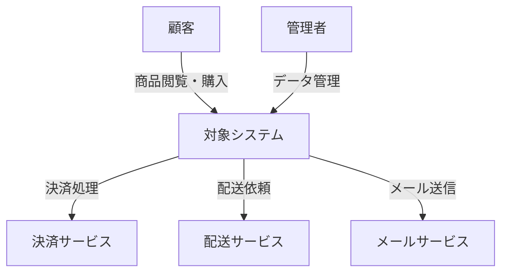

# アーキテクチャ方式 作成ガイド

## 目次

1. [アーキテクチャパターン (architecture-pattern.md)](#アーキテクチャパターン)
2. [技術スタック選定 (technology-stack.md)](#技術スタック選定)
3. [システムコンテキスト図 (system-context.md)](#システムコンテキスト図)

## Smallテンプレートの場合

Smallテンプレートでは、アーキテクチャパターン、技術スタック選定、システムコンテキスト図を **`architecture.md`** 1ファイルに統合して記述する。

### 推奨構成

```markdown
# アーキテクチャ方式

## アーキテクチャパターン
{選定パターン（モノリス/モジュラーモノリス等）と選定理由}
{比較表（主要候補2〜3の比較）}

## 技術スタック

### フロントエンド
| 技術 | 選定理由 |
|------|----------|
| {FW名} | {理由} |

### バックエンド
| 技術 | 選定理由 |
|------|----------|
| {FW名} | {理由} |

### データベース・インフラ
| 技術 | 選定理由 |
|------|----------|
| {DB名} | {理由} |

## システムコンテキスト図
{Mermaid図: 外部システム連携を含む全体像}
```

### Fullとの主な差異

- 3セクションを1ファイルにまとめる
- 技術スタックの比較表は主要技術（FW・DB・クラウド）に絞る
- システムコンテキスト図は1つの全体像図で十分（詳細なレイヤ図は省略可）
- 以下の各セクション別ガイドの内容を参考にしつつ、小規模プロジェクトに必要十分な粒度でまとめる

---

## 作成順序（Fullテンプレート）

architecture-pattern.md → technology-stack.md → system-context.md の順に作成する。
アーキテクチャパターンで全体方針を確定し、それに適合する技術スタックを選定、最後にシステム全体の外部連携を図示する。

---

## アーキテクチャパターン

### アーキテクチャ概要に含める内容

選定したアーキテクチャパターンとその根拠を記載する。

**主要な選択肢:**

| パターン | 適するケース | 注意点 |
|----------|-------------|--------|
| モジュラーモノリス | 中規模、チーム数少、初期フェーズ | モジュール境界の設計が肝要 |
| マイクロサービス | 大規模、複数チーム、独立デプロイ要求 | 運用複雑性・分散トランザクション |
| サーバーレス | イベント駆動、可変負荷、低トラフィック | コールドスタート・実行時間制限 |
| モノリス + BFF | フロント多様（Web/App）、バックエンド統合 | BFF肥大化リスク |

**記載すべき項目:**

- 選定パターンの名称と概要図（Mermaid）
- 選定理由（要件との紐付け）
- 不採用パターンとの比較
- 将来の進化パス（例: モノリス → マイクロサービスへの段階的移行）

### レイヤー構成に含める内容

システムの論理的なレイヤー分割を定義する。

**一般的なレイヤー構成:**

```
プレゼンテーション層（UI / API Gateway）
    ↓
アプリケーション層（ユースケース / オーケストレーション）
    ↓
ドメイン層（ビジネスロジック / エンティティ）
    ↓
インフラストラクチャ層（DB / 外部API / メッセージング）
```

**記載すべき項目:**

- 各レイヤーの責務
- レイヤー間の依存方向ルール（依存性逆転の適用有無）
- 横断的関心事の扱い（認証、ログ、エラーハンドリング）

### 通信パターンに含める内容

サービス間・クライアント-サーバー間の通信方式を定義する。

**主要な選択肢:**

| 方式 | 用途 | 特徴 |
|------|------|------|
| REST | CRUD操作、シンプルなAPI | 広い互換性、キャッシュ容易 |
| GraphQL | フロントエンド主導のデータ取得 | 柔軟なクエリ、オーバーフェッチ防止 |
| gRPC | サービス間通信、高性能要求 | 型安全、HTTP/2、バイナリ |
| WebSocket | リアルタイム通信 | 双方向、常時接続 |
| メッセージキュー | 非同期処理、疎結合 | 信頼性、スケーラビリティ |

**記載すべき項目:**

- 同期通信の方式と適用箇所
- 非同期通信の方式と適用箇所
- API設計方針（バージョニング、命名規則）

### 品質基準

- 要件定義の非機能要件と選定理由が紐付いていること
- アーキテクチャ図がMermaidで図示されていること
- 比較表で複数候補を検討した形跡があること

---

## 技術スタック選定

### 記載カテゴリ

以下のカテゴリごとに技術を選定し、比較・根拠を記載する。

#### フロントエンド

**選定項目:**
- フレームワーク（React / Next.js / Vue / Nuxt 等）
- 状態管理（Redux / Zustand / Pinia 等）
- UIコンポーネントライブラリ
- CSS方式（CSS Modules / Tailwind / CSS-in-JS 等）
- ビルドツール（Vite / webpack 等）

**選定観点:**
- SSR/SSG要件との適合性
- SEO要件（コンテンツ公開型サイトでは重要）
- チームの技術習熟度
- エコシステムの成熟度・コミュニティ規模
- パフォーマンス特性（バンドルサイズ、初期表示速度）

#### バックエンド

**選定項目:**
- 言語（TypeScript / Go / Java / Python 等）
- フレームワーク（NestJS / Express / Spring Boot / FastAPI 等）
- ORM / クエリビルダー
- APIドキュメント生成ツール

**選定観点:**
- 性能要件との適合性
- 型安全性
- エコシステム（ライブラリ充実度）
- デプロイ先との親和性
- 採用市場（エンジニア確保の容易さ）

#### データベース

**選定項目:**
- RDBMSの種類
- NoSQL（必要に応じて）
- 検索エンジン
- 接続方式（コネクションプール等）

※ 詳細は data-guide.md に委譲。ここでは概要と選定理由のみ記載。

#### インフラ・ミドルウェア

**選定項目:**
- クラウドプロバイダ
- コンテナオーケストレーション
- メッセージキュー
- CDN
- メール配信サービス
- 外部連携サービス（決済、認証基盤、地図 等、プロジェクトに応じて）

※ 詳細は infrastructure-guide.md に委譲。

#### 開発ツール

**選定項目:**
- ソースコード管理（GitHub / GitLab 等）
- CI/CDツール
- コード品質（Linter、Formatter、静的解析）
- テストフレームワーク
- モニタリング・ログ

### 技術スタック一覧表のフォーマット

```markdown
| カテゴリ | 技術 | バージョン | 選定理由 |
|----------|------|-----------|----------|
| FE Framework | Next.js | 14.x | SSR/SSG対応、SEO要件 |
| ... | ... | ... | ... |
```

### 品質基準

- すべての技術選定に選定理由が明記されていること
- バージョンが明記されていること（メジャーバージョン以上）
- ライセンスの商用利用可否が確認済みであること

---

## システムコンテキスト図

### システムコンテキスト図に含める内容

C4モデルのLevel 1（System Context）に相当する図を作成する。

**図に含める要素:**

- 対象システム（中心に配置）
- ユーザー種別（顧客、管理者 等）
- 外部システム（プロジェクトに応じた連携先）
- データの流れ（矢印と説明）

**Mermaid記法の例（ECサイトの場合）:**



※ 上記はECサイトの例。プロジェクトに応じてユーザー種別・外部システムを適宜置き換えること。

### 外部システム一覧に含める内容

テーブル形式で以下を記載：

| 外部システム | 連携方式 | 連携データ | 通信方向 | 備考 |
|-------------|---------|-----------|---------|------|
| （例）決済サービス | REST API | 決済情報 | 双方向 | PCI DSS準拠 |
| （例）認証基盤 | OIDC | 認証トークン | 双方向 | SSO対応 |

### データフロー概要に含める内容

主要な業務シナリオにおけるデータの流れを記載する。

**推奨シナリオ:**
- 主要業務フロー（例: 購入、申請、予約 等）
- データ登録・更新フロー
- ユーザー登録・認証フロー

### 品質基準

- すべての外部システムがコンテキスト図に含まれていること
- 連携方式（API / Webhook / バッチ 等）が明記されていること
- データの流れの方向（一方向 / 双方向）が明確であること
