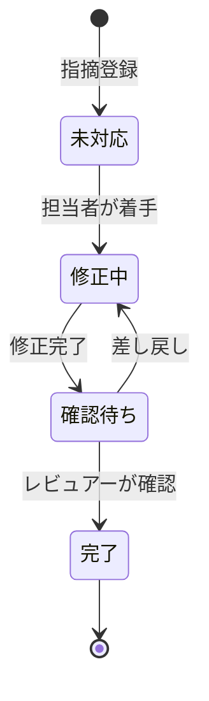
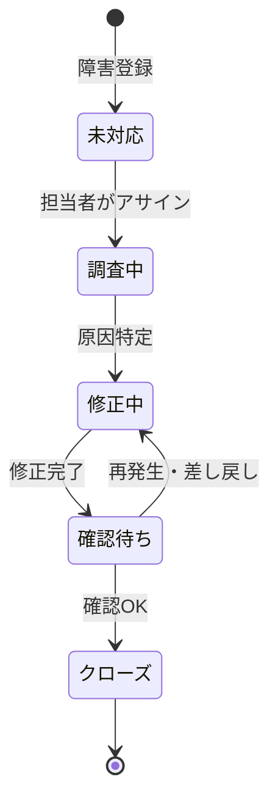

# 機能要件

## 共通事項

### 優先度の定義

| 優先度 | ラベル | 説明 |
|--------|--------|------|
| P0 | Must | 初回リリース必須。これがないとシステムとして成立しない |
| P1 | Should | 初回リリースに含めたい重要機能 |
| P2 | Could | あれば望ましいが後回し可能 |
| P3 | Won't | 今回スコープ外（将来検討） |

### 機能IDの命名規則

`FR-{カテゴリ略称}-{連番}`

| カテゴリ | 略称 |
|---------|------|
| 認証・ユーザー管理 | AUTH |
| WBS・工数管理 | WBS |
| 日報・実績入力 | DAILY |
| レビュー記録票管理 | REVIEW |
| 障害管理票 | BUG |
| レポート・分析 | REPORT |

---

## 認証・ユーザー管理

### 機能概要

システムへのアクセス制御と利用者管理を行う。ID/パスワードによる認証と、ロールに基づく機能アクセス制御を提供する。

### 機能一覧

| 機能ID | 機能名 | 概要 | 優先度 |
|--------|--------|------|--------|
| FR-AUTH-001 | ログイン | ID/パスワードによる認証 | P0 |
| FR-AUTH-002 | ログアウト | セッション終了処理 | P0 |
| FR-AUTH-003 | ユーザー管理 | ユーザーの登録・編集・無効化 | P0 |
| FR-AUTH-004 | ロール管理 | ロール（管理者/PM/開発者）の割当 | P0 |
| FR-AUTH-005 | パスワード変更 | ログインユーザー自身によるパスワード変更 | P1 |
| FR-AUTH-006 | パスワードリセット | 管理者によるパスワードリセット | P1 |

### 主要機能の詳細仕様

#### FR-AUTH-001: ログイン

| 項目 | 内容 |
|------|------|
| 入力 | メールアドレス（またはユーザーID）、パスワード |
| 出力 | セッション発行、ダッシュボードへリダイレクト |
| バリデーション | 必須チェック、認証失敗時はエラーメッセージを表示 |
| エラー時 | 「IDまたはパスワードが正しくありません」を表示（具体的な原因は非開示） |

#### FR-AUTH-003: ユーザー管理

| 項目 | 内容 |
|------|------|
| 対象ロール | 管理者のみ操作可能 |
| 管理項目 | 氏名、メールアドレス、ロール、有効/無効フラグ |
| 処理 | ユーザーの新規追加・編集・無効化（物理削除は不可） |

#### ロール定義

| ロール | 説明 | 主な操作権限 |
|--------|------|-------------|
| 管理者 | システム全体の管理者 | 全機能、ユーザー管理、全プロジェクトへのアクセス |
| PM | プロジェクトマネージャー | 担当プロジェクトのWBS・レポート管理 |
| 開発者 | 一般開発者 | 日報入力、レビュー・障害記録の登録・編集 |

---

## WBS・工数管理

### 機能概要

プロジェクトのタスクを階層構造（WBS）で管理し、予定工数と実績工数を追跡する。ガントチャートによる視覚的な進捗確認とインタラクティブな期間調整が可能。

### 機能一覧

| 機能ID | 機能名 | 概要 | 優先度 |
|--------|--------|------|--------|
| FR-WBS-001 | タスク登録 | 親子構造のタスクを登録する | P0 |
| FR-WBS-002 | タスク編集 | タスク情報（担当者・期間・ステータス等）を編集する | P0 |
| FR-WBS-003 | 予定工数管理 | タスクごとに予定工数を手動で設定する | P0 |
| FR-WBS-004 | 実績工数集計 | 日報から実績工数を自動集計して表示する | P0 |
| FR-WBS-005 | ガントチャート表示 | WBSをガントチャート形式で表示する | P1 |
| FR-WBS-006 | ガントチャート操作 | ドラッグ&ドロップでタスク期間を変更する | P1 |
| FR-WBS-007 | プロジェクト管理 | プロジェクトの登録・編集・アーカイブ | P0 |

### 主要機能の詳細仕様

#### FR-WBS-001: タスク登録

| 項目 | 内容 |
|------|------|
| 入力 | タスク名、親タスク（任意）、担当者、開始日、終了日、予定工数、ステータス |
| 出力 | タスク一覧への追加表示 |
| 制約 | 階層は3レベル（大項目 > 中項目 > 小項目）まで |
| バリデーション | タスク名・開始日・終了日は必須。終了日は開始日以降であること |

#### FR-WBS-004: 実績工数集計

| 項目 | 内容 |
|------|------|
| 処理 | 日報に紐付けられたタスクIDの作業時間を集計し、WBSの実績工数欄に反映する |
| 更新タイミング | 日報保存時にリアルタイム集計（または日次バッチ） |
| 表示 | 予定工数と実績工数を並べて表示し、差異（残工数）を算出して表示 |

#### FR-WBS-005/006: ガントチャート

| 項目 | 内容 |
|------|------|
| 表示形式 | 横軸に日付・縦軸にタスクのバーチャート形式 |
| 表示単位 | 日・週・月の切り替え可能 |
| インタラクション | バーのドラッグ&ドロップによる開始日・終了日の変更（WBSに反映） |
| 依存関係 | タスク間の依存関係表示（矢印）はP2とする |

#### タスクステータス定義

| ステータス | 説明 |
|---------|------|
| 未着手 | 作業未開始 |
| 進行中 | 作業中 |
| 完了 | 作業完了・成果物確認済み |
| 保留 | 何らかの理由で作業停止中 |

---

## 日報・実績入力

### 機能概要

開発者が日々の作業実績（時間・タスク）を記録する。カレンダー形式とリスト形式の2つの入力ビューを提供し、入力漏れを防ぐためのバリデーションを行う。

### 機能一覧

| 機能ID | 機能名 | 概要 | 優先度 |
|--------|--------|------|--------|
| FR-DAILY-001 | 日報登録 | 日付・タスク・作業時間・コメントを登録する | P0 |
| FR-DAILY-002 | カレンダービュー | 月次カレンダーで日報の入力状況を一覧表示する | P1 |
| FR-DAILY-003 | リストビュー | 期間指定で日報一覧をリスト表示する | P0 |
| FR-DAILY-004 | 日報編集 | 登録済み日報の修正 | P0 |
| FR-DAILY-005 | 入力漏れ警告 | 作業時間が0の場合に警告を表示する | P1 |

### 主要機能の詳細仕様

#### FR-DAILY-001: 日報登録

| 項目 | 内容 |
|------|------|
| 入力 | 対象日、WBSタスク（プルダウン選択）、作業時間（時間単位）、コメント（任意） |
| 出力 | 登録完了後、WBS実績工数へ自動反映 |
| 制約 | 1日に複数タスクの記録可能（複数行登録）。将来日の登録は不可 |
| バリデーション | 対象日・タスク・作業時間は必須。作業時間は0より大きい値であること |

#### FR-DAILY-005: 入力漏れ警告

| 項目 | 内容 |
|------|------|
| 条件 | 作業日（平日）に対して当日の日報が0件または合計時間が0の場合 |
| 挙動 | カレンダービューの当日セルに警告アイコンを表示。ダッシュボードにも通知する |
| ブロック | 登録を強制ブロックはしない（警告表示のみ） |

---

## レビュー記録票管理

### 機能概要

コードレビュー・設計レビューで発見された指摘事項を記録・管理する。指摘区分の分類とステータス追跡により、未対応項目の漏れを防ぐ。

### 機能一覧

| 機能ID | 機能名 | 概要 | 優先度 |
|--------|--------|------|--------|
| FR-REVIEW-001 | レビュー記録登録 | レビューセッション（日付・対象・実施者等）を登録する | P0 |
| FR-REVIEW-002 | 指摘登録 | 個別の指摘事項を登録する | P0 |
| FR-REVIEW-003 | ステータス管理 | 指摘のステータスを更新する | P0 |
| FR-REVIEW-004 | 指摘一覧表示 | ステータス・指摘区分でフィルタリングして一覧表示する | P0 |
| FR-REVIEW-005 | 修正確認登録 | 指摘への対応完了と確認日を記録する | P1 |

### 主要機能の詳細仕様

#### FR-REVIEW-001/002: レビュー記録・指摘登録

| 管理項目 | 内容 |
|---------|------|
| レビューセッション | プロジェクト、レビュー対象（資料名/ファイル名）、実施日、実施者、レビュー種別 |
| 指摘事項 | レビューセッション紐付け、指摘内容、指摘区分、重要度、担当者、ステータス、修正確認日 |

#### 指摘区分の定義（プロジェクト管理者が設定可能）

| 指摘区分（例） | 説明 |
|--------------|------|
| 設計漏れ | 仕様や設計上の考慮漏れ |
| 実装誤り | コードロジックの誤り |
| テスト不足 | テストケースの漏れや不足 |
| スタイル | コーディング規約違反 |
| その他 | 上記に分類できない指摘 |

#### ステータス遷移

---

## 障害管理票

### 機能概要

開発・テスト中に発見された障害（バグ）を記録・追跡する。重要度の分類とWBSタスクとの紐付けにより、品質状況の把握を可能にする。

### 機能一覧

| 機能ID | 機能名 | 概要 | 優先度 |
|--------|--------|------|--------|
| FR-BUG-001 | 障害登録 | 障害情報を登録する | P0 |
| FR-BUG-002 | 障害編集 | 登録済み障害の情報（原因・対策・ステータス等）を更新する | P0 |
| FR-BUG-003 | WBSタスク紐付け | 障害をWBSタスクに関連付ける | P1 |
| FR-BUG-004 | 障害一覧表示 | 重要度・ステータスでフィルタリングして一覧表示する | P0 |
| FR-BUG-005 | 検索 | キーワード・条件での障害検索 | P1 |

### 主要機能の詳細仕様

#### FR-BUG-001: 障害登録

| 管理項目 | 内容 |
|---------|------|
| 必須項目 | 障害ID（自動採番）、発生日、発見フェーズ、現象（タイトル）、重要度、ステータス、担当者 |
| 任意項目 | 詳細説明、再現手順、原因分析、対策内容、修正確認日、関連WBSタスク |

#### 重要度定義

| 重要度 | 説明 | 例 |
|--------|------|----|
| 致命的 | システム停止・データ損失を招く | クラッシュ、データ破損 |
| 高 | 主要機能が使用不能 | ログイン不可、保存エラー |
| 中 | 機能は動作するが著しく不便 | 表示崩れ、パフォーマンス低下 |
| 低 | 軽微な問題、回避策あり | 文言ミス、UIの細かな不整合 |

#### ステータス遷移

---

## レポート・分析

### 機能概要

蓄積されたプロジェクトデータをグラフ・チャートで可視化し、進捗・品質の定量的な把握を支援する。EVMによる進捗管理、信頼性成長曲線による品質収束確認、傾向分析による問題の早期発見を提供する。

### 機能一覧

| 機能ID | 機能名 | 概要 | 優先度 |
|--------|--------|------|--------|
| FR-REPORT-001 | EVM分析 | PV/AC/EVの推移グラフを表示する | P1 |
| FR-REPORT-002 | 信頼性成長曲線 | 累積バグ発見数・修正数の推移グラフを表示する | P1 |
| FR-REPORT-003 | 指摘区分分析 | レビュー指摘の区分別集計を円グラフで表示する | P1 |
| FR-REPORT-004 | 障害密度分析 | 担当者別・モジュール別の障害密度を表示する | P1 |
| FR-REPORT-005 | ダッシュボード | 主要指標を1画面にサマリー表示する | P0 |

### 主要機能の詳細仕様

#### FR-REPORT-001: EVM分析

| 項目 | 内容 |
|------|------|
| 対象データ | WBSの予定工数（PV）、実績工数（AC）、完了タスクの予定工数（EV） |
| 表示形式 | 折れ線グラフ（X軸: 日付, Y軸: 工数[人時]） |
| 派生指標 | SPI（= EV/PV）、CPI（= EV/AC）をグラフ下部に数値表示 |
| 期間 | プロジェクト開始〜現在または指定期間 |

#### FR-REPORT-002: 信頼性成長曲線

| 項目 | 内容 |
|------|------|
| 対象データ | 障害管理票の発生日・修正確認日 |
| 表示形式 | 折れ線グラフ（X軸: 日付, Y軸: 累積件数） |
| 系列 | 累積バグ発見数（赤）、累積修正完了数（青）の2系列 |

#### FR-REPORT-003: 指摘区分分析

| 項目 | 内容 |
|------|------|
| 対象データ | レビュー記録票の指摘区分 |
| 表示形式 | 円グラフ + 件数テーブル |
| フィルタ | プロジェクト・期間での絞り込み可能 |

#### FR-REPORT-004: 障害密度分析

| 項目 | 内容 |
|------|------|
| 指標 | 担当者別の障害件数（重要度別集計）、WBSモジュール別の障害件数 |
| 表示形式 | 棒グラフ + サマリーテーブル |
| 用途 | 高障害密度エリアの特定によるレビュー・テストの重点化 |

#### FR-REPORT-005: ダッシュボード

| 表示項目 | 内容 |
|---------|------|
| 進捗サマリー | SPI・CPI・タスク完了率 |
| 障害サマリー | 未クローズ障害数（重要度別） |
| 未対応指摘 | レビュー未対応件数 |
| 日報アラート | 入力漏れ通知（当日0時間入力の場合） |
