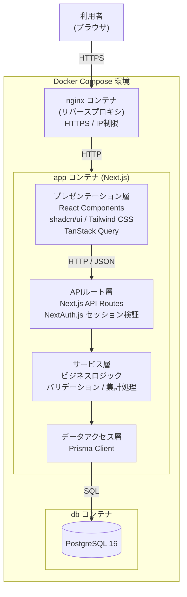
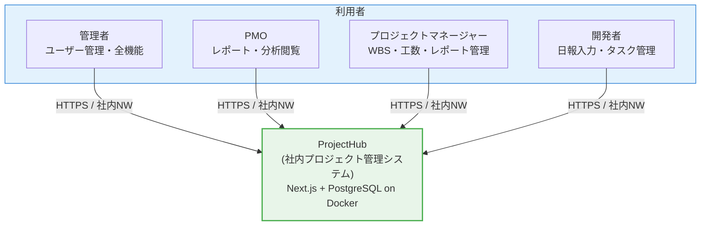

# アーキテクチャ方式

## アーキテクチャパターン

### 採用パターン：モノリシックフルスタック

本システムは **Next.js によるモノリシックフルスタック構成** を採用する。フロントエンド（React）とバックエンド（API Routes）を単一のNext.jsアプリケーションとして実装し、Dockerコンテナ上で稼働させる。

### アーキテクチャパターン比較

| 観点 | モノリス | モジュラーモノリス | マイクロサービス |
|------|---------|-----------------|----------------|
| 適合性（〜20名規模） | ○ | ○ | △ |
| 開発速度 | ○ 速い | ○ 速い | △ 遅い |
| 運用複雑性 | ○ 低い | ○ 低い | × 高い |
| スケーラビリティ | △ | △ | ○ |
| チーム分割対応 | △ | ○ | ○ |
| **総合評価** | **採用** | 次点 | 不採用 |

**選定理由:**

- 最大20名の小規模利用であり、スケールアウトの必要性が低い
- 社内開発チームのみで開発・運用するため、運用複雑性を最小化する
- Next.js API Routes により FE/BE を単一コードベースで管理でき、TypeScript の型共有が可能
- 将来的に規模が拡大した場合、モジュール境界を意識した設計によりマイクロサービス化の余地を残す

### レイヤー構成と責務

| レイヤー | 実装場所 | 主な責務 |
|---------|---------|---------|
| プレゼンテーション層 | `app/` (React Components / Pages) | UI表示、ユーザー操作の受付、TanStack Query によるデータフェッチ |
| APIルート層 | `app/api/` (Next.js API Routes) | HTTPリクエスト受付、認証・認可チェック、レスポンス整形 |
| サービス層 | `lib/services/` | ビジネスロジック、バリデーション、集計処理 |
| データアクセス層 | `lib/prisma/` | Prisma Client によるDB操作 |
| データ層 | PostgreSQL コンテナ | データ永続化 |

**横断的関心事の扱い:**

| 関心事 | 実装方針 |
|-------|---------|
| 認証 | NextAuth.js がセッション管理を担う。API Routes で `getServerSession()` により検証 |
| 認可 | API Routes 内でロール（管理者/PMO/PM/開発者）を確認し、権限外の操作を 403 で拒否 |
| エラーハンドリング | API Routes で共通エラーレスポンス形式に統一。フロントは TanStack Query のエラー状態で表示 |
| ログ | アプリケーションログを標準出力に出力し、Dockerログとして収集 |

---

## 技術スタック

### フロントエンド

| カテゴリ | 技術 | バージョン | 選定理由 |
|---------|------|-----------|---------|
| フレームワーク | Next.js (App Router) | 14.x | 要件で指定済み。SSR・API Routes・TypeScript標準対応 |
| UIコンポーネント | shadcn/ui | latest | 要件で指定済み。Radix UI基盤の高品質コンポーネント |
| CSS | Tailwind CSS | 3.x | 要件で指定済み。ユーティリティファースト、カスタマイズ性高 |
| データフェッチ / 状態管理 | TanStack Query | 5.x | サーバー状態のキャッシュ・ローディング・エラー管理を統括 |
| 言語 | TypeScript | 5.x | FE/BE共通の型安全を確保し、保守性を向上 |

### バックエンド

| カテゴリ | 技術 | バージョン | 選定理由 |
|---------|------|-----------|---------|
| APIサーバー | Next.js API Routes | 14.x | FEと同一コードベース。インフラ追加なしでAPI提供が可能 |
| ランタイム | Node.js (LTS) | 20.x | 非機能要件でLTS版を指定済み |
| 認証 | NextAuth.js (Auth.js) | 5.x | Next.js公式推奨。セッション管理・パスワード認証を内包し実装量を最小化 |
| ORM | Prisma | 5.x | 型安全なDBアクセス。スキーマ駆動のマイグレーション管理 |

### データベース・インフラ

| カテゴリ | 技術 | バージョン | 選定理由 |
|---------|------|-----------|---------|
| データベース | PostgreSQL | 16.x | 要件で指定済み。ACID特性・信頼性・豊富なエコシステム |
| コンテナ | Docker | 24.x | 要件で指定済み。将来的なインフラ変更（オンプレ⇔クラウド）に対応 |
| コンテナ構成管理 | Docker Compose | 2.x | 要件で指定済み。`docker compose up` での一括起動 |
| リバースプロキシ | nginx | 1.25.x | HTTPS終端・IPアクセス制限（非機能要件）を担う |

### 開発ツール

| カテゴリ | 技術 | 選定理由 |
|---------|------|---------|
| ソースコード管理 | Git / GitHub | 既存利用。変更履歴管理・コードレビュー |
| Linter | ESLint | Next.js標準。コード品質統一 |
| Formatter | Prettier | コードフォーマット統一 |
| テスト | Vitest + Testing Library | 軽量・高速。Next.js環境との親和性良好 |
| E2Eテスト | Playwright | ブラウザ操作の自動テスト |

---

## システムコンテキスト図

!!! info "外部システム連携なし"
    本システムはスコープ定義により、外部システム（Jira・Slack・GitHub 等）との連携を対象外とする。
    全データはシステム内の PostgreSQL に閉じて管理する。

### アクセスパス

| 経路 | 詳細 |
|------|------|
| 利用者 → nginx | HTTPS (TLS 1.2以上)。社内IPアドレス/CIDRレンジのみ許可 |
| nginx → Next.js | HTTP（内部通信。Docker内ネットワーク経由） |
| Next.js → PostgreSQL | TCP（Docker内ネットワーク経由。接続情報は環境変数で管理） |

---

## 通信方式

| 区分 | 方式 | 適用箇所 |
|------|------|---------|
| クライアント↔サーバー | REST API / JSON | TanStack Query → Next.js API Routes |
| セッション管理 | サーバーサイドセッション（NextAuth.js） | 認証後のリクエスト全般 |
| リアルタイム通信 | 採用しない（ポーリングで代替） | 必要に応じてTanStack Queryの自動再取得を利用 |

### API設計方針

- エンドポイントは `/api/` プレフィックスで統一する
- HTTPメソッドはRESTの意味論に従う（GET/POST/PUT/DELETE）
- レスポンス形式は JSON で統一する
- エラーレスポンスは `{ error: { code: string, message: string } }` 形式で統一する
- APIバージョニングは初期フェーズでは行わない（`/api/v1/` は採用しない）
