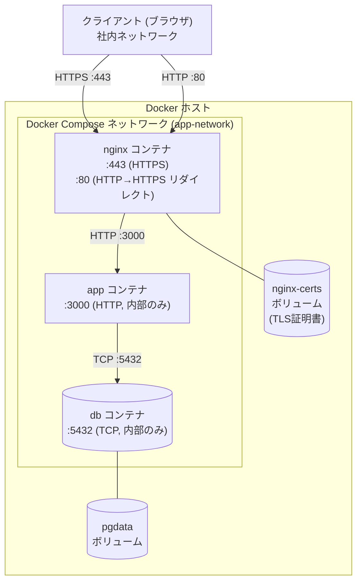
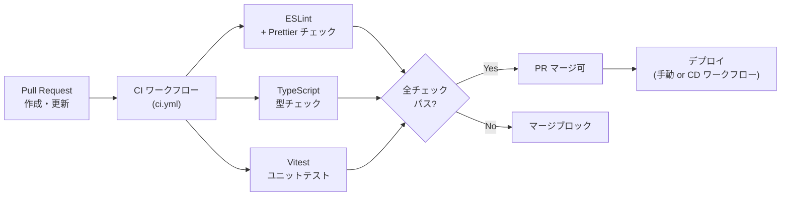

# インフラ・運用方式

## インフラ構成

### 基本方針

本システムは **Docker Compose によるコンテナ構成** を採用し、特定のインフラプラットフォームに依存しない設計とする。
Docker が動作する環境（オンプレミスサーバー・クラウド VPS・IaaS 等）であれば同一の構成でデプロイ可能とする。

!!! info "インフラ非依存設計"
    稼働環境はオンプレミス・クラウドを問わず、`docker compose up` による一括起動を前提とする。
    インフラ確定後も docker-compose.yml の修正のみで移行できるよう、アプリケーションコードはインフラ固有の依存を持たない設計とする。

### コンテナ構成

3 つのコンテナで構成し、Docker Compose により管理する。

| コンテナ名 | イメージ | 役割 |
|-----------|---------|------|
| `nginx` | nginx:1.25-alpine | リバースプロキシ・HTTPS 終端・IP アクセス制限 |
| `app` | node:20-alpine（カスタムビルド） | Next.js アプリケーション（フロントエンド + API Routes） |
| `db` | postgres:16-alpine | PostgreSQL データベース |



### Docker Compose 構成方針

```yaml title="docker-compose.yml 構成イメージ"
services:
  nginx:
    image: nginx:1.25-alpine
    ports:
      - "80:80"
      - "443:443"
    volumes:
      - ./nginx/nginx.conf:/etc/nginx/nginx.conf:ro
      - nginx-certs:/etc/nginx/certs:ro
    depends_on:
      - app

  app:
    build:
      context: .
      dockerfile: Dockerfile
    environment:
      - DATABASE_URL=${DATABASE_URL}
      - NEXTAUTH_SECRET=${NEXTAUTH_SECRET}
      - NEXTAUTH_URL=${NEXTAUTH_URL}
    depends_on:
      db:
        condition: service_healthy

  db:
    image: postgres:16-alpine
    environment:
      - POSTGRES_DB=${POSTGRES_DB}
      - POSTGRES_USER=${POSTGRES_USER}
      - POSTGRES_PASSWORD=${POSTGRES_PASSWORD}
    volumes:
      - pgdata:/var/lib/postgresql/data
    healthcheck:
      test: ["CMD-SHELL", "pg_isready -U ${POSTGRES_USER}"]
      interval: 10s
      timeout: 5s
      retries: 5

volumes:
  pgdata:
  nginx-certs:
```

### ネットワーク設計

| 通信経路 | プロトコル | 補足 |
|---------|-----------|------|
| クライアント → nginx | HTTPS (TLS 1.2以上) | 社内 IP/CIDR のみ許可。HTTP は HTTPS へリダイレクト |
| nginx → app | HTTP (Docker 内部通信) | ポート 3000。外部へ非公開 |
| app → db | TCP (Docker 内部通信) | ポート 5432。外部へ非公開 |

!!! warning "IPアクセス制限"
    nginx の設定で `allow`/`deny` ディレクティブを使用し、社内 IP アドレス/CIDR レンジ以外からのアクセスをすべて `deny` する。
    具体的な CIDR レンジはデプロイ時にインフラ担当者と確認して設定する。

### 環境変数管理

機密情報（DB 接続情報・認証シークレット）はソースコードにハードコードせず、環境変数で管理する。

| 環境変数 | 内容 | 管理方法 |
|---------|------|---------|
| `DATABASE_URL` | PostgreSQL 接続文字列 | `.env.local` (本番) / `.env.test` (テスト) |
| `NEXTAUTH_SECRET` | NextAuth.js セッション署名鍵 | `.env.local`（32文字以上のランダム文字列） |
| `NEXTAUTH_URL` | アプリの正規 URL | `.env.local` |
| `POSTGRES_DB/USER/PASSWORD` | DB 初期化パラメータ | `.env.local` |

!!! note "`.env.local` の管理"
    `.env.local` は `.gitignore` に追加し、リポジトリにコミットしない。
    `.env.example` でキー名のみ公開し、値はデプロイ担当者が個別に設定する。

---

## 開発環境

### 前提条件

開発者 PC は **Windows** を対象とする。以下のツールを事前にインストールする。

| ツール | バージョン | 用途 |
|-------|-----------|------|
| Docker Desktop for Windows | 4.x 以上 | コンテナ実行環境（WSL2 バックエンドを使用） |
| Node.js (LTS) | 20.x | ローカルでの npm スクリプト実行（lint / test 等） |
| Git for Windows | latest | ソースコード管理。Git Bash 経由でシェルコマンドを実行 |
| VSCode | latest | 推奨エディタ |

!!! warning "WSL2 の有効化"
    Docker Desktop for Windows は WSL2 バックエンドを使用する。
    インストール前に Windows の「Linux 用 Windows サブシステム」と「仮想マシン プラットフォーム」機能を有効化しておくこと。

### 行末文字の統一（LF）

Windows はデフォルトで CRLF を使用するが、Linux コンテナ内のシェルスクリプト・設定ファイルは LF が必須。
`.gitattributes` を設定し、リポジトリ内のテキストファイルの行末文字を LF に統一する。

```text title=".gitattributes"
* text=auto eol=lf
*.ts text eol=lf
*.tsx text eol=lf
*.json text eol=lf
*.yml text eol=lf
*.yaml text eol=lf
*.sh text eol=lf
*.md text eol=lf
```

### シェルコマンドの実行環境

バックアップ・リカバリ手順などの bash スクリプトは **Git Bash または WSL2** から実行する。
PowerShell / コマンドプロンプトからは動作しない。

### パフォーマンスに関する推奨事項

Docker Desktop for Windows のファイルシステムパフォーマンスを最大化するため、プロジェクトのクローン先は **WSL2 のファイルシステム上** を推奨する。

| クローン先 | パフォーマンス | 推奨 |
|-----------|--------------|------|
| `C:\Users\...`（Windows FS） | 低（バインドマウント経由の I/O が遅い） | 非推奨 |
| `\\wsl$\Ubuntu\home\...`（WSL2 FS） | 高 | 推奨 |

!!! tip "WSL2 上での VSCode 利用"
    プロジェクトを WSL2 ファイルシステムに置いた場合、VSCode の「WSL」拡張機能を使用することで
    Windows から透過的に WSL2 上のファイルを編集・操作できる。

---

## セキュリティ方式

### 認証方式

**採用方式:** NextAuth.js（Auth.js v5）によるサーバーサイドセッション認証

| 項目 | 設計 |
|------|------|
| 認証方式 | ID（メールアドレス）+ パスワード（Credentials Provider） |
| セッション管理 | NextAuth.js がサーバーサイドセッションを管理。Cookie にセッション ID を保存 |
| セッション有効期限 | 最終操作から 30 分でセッション切れ（`maxAge` と `updateAge` を設定） |
| パスワードハッシュ | bcrypt（コストファクター 12 以上）でハッシュ化。平文保存禁止 |
| 初回パスワード変更 | 初回ログイン時にパスワード変更を強制するフラグを DB で管理 |

**パスワードポリシー:**

| ポリシー | 要件 |
|---------|------|
| 最低文字数 | 8 文字以上 |
| 文字種 | 英字（大/小文字いずれか）＋数字を各 1 文字以上含む |
| 有効期限 | 初回ログイン時の変更を強制。以降の定期変更は任意 |
| 履歴制限 | 直前 3 世代のパスワード再利用禁止 |

### 認可方式

**採用方式:** ロールベースアクセス制御（RBAC）

| ロール | 権限範囲 |
|--------|---------|
| 管理者 | 全機能 + ユーザー管理 + 操作ログ閲覧 |
| PMO | レポート・分析閲覧（読み取り専用）、複数プロジェクト横断閲覧 |
| PM | WBS・工数管理、レビュー・障害管理、レポート閲覧（担当プロジェクト） |
| 開発者 | 日報入力、自分のタスク管理、WBS 閲覧 |

**実装方針:**

- Next.js API Routes で `getServerSession()` によりセッション情報を検証
- ロールは DB の `users` テーブルの `role` カラムで管理
- 権限外のリクエストには HTTP 403 を返す
- フロントエンドのナビゲーション非表示はあくまで UI 補助であり、バックエンドでの認可チェックを必須とする

### データ保護

| 対策 | 実装方針 |
|------|---------|
| 通信暗号化 | nginx で HTTPS（TLS 1.2以上）を強制。HTTP は 301 で HTTPS へリダイレクト |
| TLS 証明書 | 自己署名証明書（openssl で生成）を nginx に設定。社内クライアントに証明書を配布 |
| パスワード保存 | bcrypt ハッシュ化（平文保存厳禁） |
| DB 接続情報 | 環境変数で管理。ソースコードへのハードコード禁止 |
| CSP ヘッダ | Next.js の `headers()` で Content-Security-Policy を設定し XSS を抑制 |
| Cookie 属性 | `HttpOnly`・`Secure`・`SameSite=Lax` を設定し CSRF・盗聴を防止 |

**TLS 証明書の生成・運用:**

```bash title="自己署名証明書の生成（openssl）"
openssl req -x509 -nodes -days 365 \
  -newkey rsa:2048 \
  -keyout server.key \
  -out server.crt \
  -subj "/CN=projecthub.internal"
```

証明書は `nginx-certs` ボリュームに格納し、有効期限（365 日）前に更新する。

### 脆弱性対策

| 脅威 | 対策 |
|------|------|
| SQL インジェクション | Prisma のパラメータバインドを使用。動的 SQL 直接組み立て禁止 |
| XSS | React の自動エスケープ + CSP ヘッダ設定 |
| CSRF | NextAuth.js の CSRF トークン + `SameSite=Lax` Cookie |
| 依存ライブラリ脆弱性 | CI で `npm audit` を実行。CRITICAL は即時対応、HIGH は 1 週間以内に対応 |

---

## CI/CD 方式

### パイプライン概要

GitHub Actions を使用し、コードの品質保証を自動化する。



### CI ワークフロー（PR 時）

**トリガー:** Pull Request（`main` ブランチへの PR 作成・更新時）

| ステップ | 内容 |
|---------|------|
| Checkout | `actions/checkout` でソースを取得 |
| Node.js セットアップ | `actions/setup-node` (Node.js 20.x LTS) |
| 依存インストール | `npm ci`（`package-lock.json` に基づく再現可能なインストール） |
| Lint チェック | `npm run lint`（ESLint + Prettier） |
| 型チェック | `npm run type-check`（`tsc --noEmit`） |
| ユニットテスト | `npm run test`（Vitest） |
| セキュリティ監査 | `npm audit --audit-level=critical` |

### デプロイ方式

初期フェーズは手動デプロイとする。

| フェーズ | デプロイ手順 |
|---------|------------|
| 初期 | SSH でデプロイ対象ホストに接続 → `git pull` → `docker compose up -d --build` |
| 将来 | CD ワークフロー（`main` push 時に自動デプロイ）への移行を検討 |

!!! note "デプロイ手順書"
    実際のデプロイ手順（SSH 接続先、証明書更新手順、マイグレーション実行方法）は別途運用手順書として整備する。

---

## 監視・ログ方式

### コンテナ死活監視

| 監視対象 | 方式 |
|---------|------|
| app コンテナ | `/api/health` エンドポイントへの HTTP GET。`{"status": "ok"}` を返す |
| db コンテナ | Docker Compose の `healthcheck`（`pg_isready` コマンド） |
| nginx コンテナ | Docker の `container_status` 監視 |

```typescript title="/api/health のレスポンス例"
// GET /api/health
{ "status": "ok", "timestamp": "2026-02-18T00:00:00Z" }
```

インフラ担当者がホストの cron 等でヘルスチェックエンドポイントを定期ポーリングし、障害検知時にアラートを発する（具体的な通知手段はインフラ確定後に決定）。

### ログ設計

**ログの出力先:** 標準出力（Docker ログとして収集）

| ログ種別 | 出力箇所 | 保持期間 | 内容 |
|---------|---------|---------|------|
| アクセスログ | nginx | 30 日 | リクエスト・レスポンス（IP・URL・ステータス） |
| アプリケーションログ | Next.js（標準出力） | 30 日 | INFO/WARN レベルのイベント |
| エラーログ | Next.js（標準エラー出力） | 90 日 | ERROR レベルの例外・スタックトレース |
| 操作ログ | DB テーブル（`audit_logs`） | 90 日以上 | 認証・ユーザー管理・レビュー/障害の CRUD 操作 |

**操作ログのスキーマ（`audit_logs` テーブル）:**

| カラム | 型 | 説明 |
|-------|-----|------|
| `id` | UUID | プライマリキー |
| `timestamp` | TIMESTAMP | 操作日時（UTC） |
| `user_id` | UUID | 操作したユーザー ID |
| `action` | VARCHAR | 操作内容（`LOGIN`, `LOGOUT`, `CREATE_USER`, `UPDATE_REVIEW`, 等） |
| `resource_type` | VARCHAR | 対象リソース種別（`user`, `review`, `defect`, 等） |
| `resource_id` | UUID | 対象リソース ID |
| `detail` | JSONB | 追加情報（変更前後の値等） |

!!! note "操作ログへのアクセス制限"
    操作ログの閲覧は管理者ロールのみ許可する。一般ユーザーへの参照 API は提供しない。

### ログローテーション

Docker ログドライバー（`json-file`）の `max-size` / `max-file` オプションでローカルでのログ肥大化を防ぐ。

```json title="docker-compose.yml の logging 設定例"
logging:
  driver: "json-file"
  options:
    max-size: "100m"
    max-file: "10"
```

---

## バックアップ・リカバリ

### バックアップ方針

| 項目 | 設計 |
|------|------|
| 対象 | PostgreSQL データベース全体（`pg_dump` による論理バックアップ） |
| 頻度 | 手動（担当者がリリース前・マイグレーション前等の任意タイミングで実施） |
| 保持世代数 | 7 世代（古い世代は手動で削除） |
| 保管場所 | Docker ホストのローカルボリューム（可能であれば OS ディスクとは別ディスクに配置） |
| ファイル形式 | `projecthub_YYYYMMDD_HHMMSS.dump`（PostgreSQL カスタム形式） |

### バックアップ手順

```bash title="バックアップ実行コマンド"
# pg_dump を実行してダンプファイルを作成
docker compose exec db pg_dump \
  -U ${POSTGRES_USER} \
  -Fc \
  ${POSTGRES_DB} \
  > /backup/projecthub_$(date +%Y%m%d_%H%M%S).dump
```

### リカバリ手順

```bash title="リカバリ実行コマンド"
# 1. データベースを初期化（既存 DB を削除して再作成）
docker compose exec db dropdb -U ${POSTGRES_USER} ${POSTGRES_DB}
docker compose exec db createdb -U ${POSTGRES_USER} ${POSTGRES_DB}

# 2. ダンプファイルからリストア
docker compose exec -T db pg_restore \
  -U ${POSTGRES_USER} \
  -d ${POSTGRES_DB} \
  < /backup/projecthub_YYYYMMDD_HHMMSS.dump

# 3. アプリケーションの動作確認
curl -k https://localhost/api/health
```

!!! warning "リストア確認"
    リストア手順を定期的（年 1 回以上）に実施し、手順の有効性を確認する。
    リストア完了後は主要機能（ログイン・データ参照）を手動で確認すること。

### RTO / RPO の達成方針

| 指標 | 要件値 | 達成方針 |
|------|--------|---------|
| RTO（目標復旧時間） | 4 時間以内 | バックアップからのリカバリ手順書を整備し、担当者が 4 時間以内に対応できる体制を維持 |
| RPO（目標復旧時点） | 24 時間以内 | 手動バックアップ運用のため、重要な変更前に必ずバックアップを取得するルールを設ける |

!!! note "将来的な自動化"
    RPO の安定確保のため、将来的には cron による日次自動バックアップへの移行を検討する。
