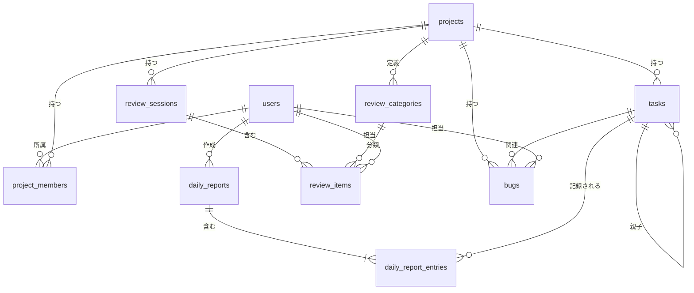

# データモデル

## ER図

### エンティティグループ

| グループ | テーブル | 説明 |
|---------|---------|------|
| ユーザー管理 | users | ユーザー情報・ロール・認証 |
| プロジェクト管理 | projects, project_members | プロジェクト基本情報・メンバー所属 |
| WBS・タスク管理 | tasks | 親子階層タスク・工数管理 |
| 日報・実績管理 | daily_reports, daily_report_entries | 日次作業記録 |
| レビュー管理 | review_sessions, review_categories, review_items | レビュー記録・指摘管理 |
| 障害管理 | bugs | 障害登録・追跡 |

### 設計方針

- **論理削除**: `users` テーブルのみ `deleted_at` による論理削除を採用（FR-AUTH-003: 物理削除不可）
- **その他テーブル**: `status` カラムやビジネスルールでライフサイクルを管理。物理削除は許容
- **障害番号**: プロジェクト内連番。`projects.bug_sequence` でシーケンスを管理し `BUG-001` 形式で生成
- **タスク階層**: 3レベル制限（大項目/中項目/小項目）はアプリケーション層で制御

---

## テーブル一覧

| # | テーブルID | テーブル名 | 論理名 | 概要 |
|---|-----------|-----------|--------|------|
| 1 | TBL-001 | users | ユーザー | システム利用者情報・認証・ロール管理 |
| 2 | TBL-002 | projects | プロジェクト | プロジェクト基本情報 |
| 3 | TBL-003 | project_members | プロジェクトメンバー | ユーザーとプロジェクトの所属関係 |
| 4 | TBL-004 | tasks | タスク（WBS） | 階層構造タスク・予定工数 |
| 5 | TBL-005 | daily_reports | 日報ヘッダー | ユーザー×日付の日報単位 |
| 6 | TBL-006 | daily_report_entries | 日報明細 | タスク別作業時間記録 |
| 7 | TBL-007 | review_sessions | レビューセッション | レビュー実施記録（日付・対象・種別） |
| 8 | TBL-008 | review_categories | 指摘区分マスタ | プロジェクト固有の指摘区分定義 |
| 9 | TBL-009 | review_items | レビュー指摘事項 | 個別指摘内容・ステータス管理 |
| 10 | TBL-010 | bugs | 障害管理票 | バグ・障害の登録・追跡 |
| 11 | TBL-011 | audit_logs | 操作ログ | システム操作の監査ログ（非機能要件 NFR-SEC 対応） |

---

## テーブル定義

### ユーザー管理

#### users（TBL-001）

| No | カラム名 | データ型 | NULL | デフォルト | 説明 |
|----|---------|---------|------|-----------|------|
| 1 | id | BIGINT | NO | 自動採番 | 主キー |
| 2 | name | VARCHAR(100) | NO | — | 氏名 |
| 3 | email | VARCHAR(255) | NO | — | メールアドレス（ログインID） |
| 4 | password_hash | VARCHAR(255) | NO | — | パスワードハッシュ（bcrypt） |
| 5 | role | VARCHAR(20) | NO | — | ロール（admin / pmo / pm / developer） |
| 6 | is_active | BOOLEAN | NO | true | 有効フラグ（falseで無効化） |
| 7 | created_at | TIMESTAMP | NO | 現在時刻 | 作成日時 |
| 8 | updated_at | TIMESTAMP | NO | 現在時刻 | 更新日時 |
| 9 | deleted_at | TIMESTAMP | YES | NULL | 論理削除日時（NULL=有効） |

**制約・インデックス:**

| 種別 | カラム | 備考 |
|------|--------|------|
| UNIQUE | email | ログインID重複防止 |
| INDEX | role | ロール別検索用 |
| INDEX | is_active | 有効ユーザー絞り込み用 |

!!! note "ロール定義"
    `admin`（管理者）/ `pmo`（PMO）/ `pm`（プロジェクトマネージャー）/ `developer`（開発者）

---

### プロジェクト管理

#### projects（TBL-002）

| No | カラム名 | データ型 | NULL | デフォルト | 説明 |
|----|---------|---------|------|-----------|------|
| 1 | id | BIGINT | NO | 自動採番 | 主キー |
| 2 | name | VARCHAR(200) | NO | — | プロジェクト名 |
| 3 | description | TEXT | YES | NULL | プロジェクト説明 |
| 4 | start_date | DATE | NO | — | 開始日 |
| 5 | end_date | DATE | YES | NULL | 終了予定日 |
| 6 | status | VARCHAR(20) | NO | 'active' | ステータス（active / archived） |
| 7 | bug_sequence | INT | NO | 0 | 障害番号連番カウンター |
| 8 | created_by | BIGINT | NO | — | 作成者（FK: users.id） |
| 9 | created_at | TIMESTAMP | NO | 現在時刻 | 作成日時 |
| 10 | updated_at | TIMESTAMP | NO | 現在時刻 | 更新日時 |

**外部キー:**

| カラム | 参照先 | ON DELETE | ON UPDATE |
|--------|--------|-----------|-----------|
| created_by | users(id) | RESTRICT | CASCADE |

**制約・インデックス:**

| 種別 | カラム | 備考 |
|------|--------|------|
| INDEX | status | アクティブプロジェクト絞り込み用 |

---

#### project_members（TBL-003）

| No | カラム名 | データ型 | NULL | デフォルト | 説明 |
|----|---------|---------|------|-----------|------|
| 1 | id | BIGINT | NO | 自動採番 | 主キー |
| 2 | project_id | BIGINT | NO | — | プロジェクトID（FK: projects.id） |
| 3 | user_id | BIGINT | NO | — | ユーザーID（FK: users.id） |
| 4 | is_favorite | BOOLEAN | NO | false | お気に入りフラグ（API設計書 `PUT /api/projects/[id]/favorite` 対応） |
| 5 | created_at | TIMESTAMP | NO | 現在時刻 | 作成日時 |
| 6 | updated_at | TIMESTAMP | NO | 現在時刻 | 更新日時 |

**外部キー:**

| カラム | 参照先 | ON DELETE | ON UPDATE |
|--------|--------|-----------|-----------|
| project_id | projects(id) | CASCADE | CASCADE |
| user_id | users(id) | RESTRICT | CASCADE |

**制約・インデックス:**

| 種別 | カラム | 備考 |
|------|--------|------|
| UNIQUE | (project_id, user_id) | 同一プロジェクトへの重複所属防止 |

---

### WBS・タスク管理

#### tasks（TBL-004）

| No | カラム名 | データ型 | NULL | デフォルト | 説明 |
|----|---------|---------|------|-----------|------|
| 1 | id | BIGINT | NO | 自動採番 | 主キー |
| 2 | project_id | BIGINT | NO | — | 所属プロジェクト（FK: projects.id） |
| 3 | parent_task_id | BIGINT | YES | NULL | 親タスクID（FK: tasks.id）NULLで大項目 |
| 4 | level | SMALLINT | NO | — | 階層レベル（1=大項目 / 2=中項目 / 3=小項目） |
| 5 | name | VARCHAR(300) | NO | — | タスク名 |
| 6 | assignee_id | BIGINT | YES | NULL | 担当者（FK: users.id） |
| 7 | start_date | DATE | NO | — | 開始予定日 |
| 8 | end_date | DATE | NO | — | 終了予定日 |
| 9 | planned_hours | DECIMAL(8,2) | NO | 0 | 予定工数（時間） |
| 10 | status | VARCHAR(20) | NO | '未着手' | ステータス（未着手/進行中/完了/保留） |
| 11 | sort_order | INT | NO | 0 | 同一親内での表示順 |
| 12 | created_at | TIMESTAMP | NO | 現在時刻 | 作成日時 |
| 13 | updated_at | TIMESTAMP | NO | 現在時刻 | 更新日時 |

**外部キー:**

| カラム | 参照先 | ON DELETE | ON UPDATE |
|--------|--------|-----------|-----------|
| project_id | projects(id) | CASCADE | CASCADE |
| parent_task_id | tasks(id) | RESTRICT | CASCADE |
| assignee_id | users(id) | SET NULL | CASCADE |

**制約・インデックス:**

| 種別 | カラム | 備考 |
|------|--------|------|
| INDEX | project_id | プロジェクト別タスク取得用 |
| INDEX | parent_task_id | 子タスク一覧取得用 |
| INDEX | assignee_id | 担当者別タスク取得用 |
| INDEX | status | ステータスフィルター用 |

!!! note "実績工数の扱い"
    実績工数は `daily_report_entries.work_hours` の集計値として算出する。tasks テーブルには持たず、参照時にクエリで集計する。

---

### 日報・実績管理

#### daily_reports（TBL-005）

| No | カラム名 | データ型 | NULL | デフォルト | 説明 |
|----|---------|---------|------|-----------|------|
| 1 | id | BIGINT | NO | 自動採番 | 主キー |
| 2 | user_id | BIGINT | NO | — | 記録者（FK: users.id） |
| 3 | work_date | DATE | NO | — | 作業日 |
| 4 | created_at | TIMESTAMP | NO | 現在時刻 | 作成日時 |
| 5 | updated_at | TIMESTAMP | NO | 現在時刻 | 更新日時 |

**外部キー:**

| カラム | 参照先 | ON DELETE | ON UPDATE |
|--------|--------|-----------|-----------|
| user_id | users(id) | RESTRICT | CASCADE |

**制約・インデックス:**

| 種別 | カラム | 備考 |
|------|--------|------|
| UNIQUE | (user_id, work_date) | 1ユーザー×1日1レコード |
| INDEX | work_date | 日付範囲検索・カレンダー表示用 |

---

#### daily_report_entries（TBL-006）

| No | カラム名 | データ型 | NULL | デフォルト | 説明 |
|----|---------|---------|------|-----------|------|
| 1 | id | BIGINT | NO | 自動採番 | 主キー |
| 2 | daily_report_id | BIGINT | NO | — | 日報ヘッダー（FK: daily_reports.id） |
| 3 | task_id | BIGINT | NO | — | 作業タスク（FK: tasks.id） |
| 4 | work_hours | DECIMAL(5,2) | NO | — | 作業時間（時間単位、0より大きい値） |
| 5 | comment | TEXT | YES | NULL | コメント |
| 6 | created_at | TIMESTAMP | NO | 現在時刻 | 作成日時 |
| 7 | updated_at | TIMESTAMP | NO | 現在時刻 | 更新日時 |

**外部キー:**

| カラム | 参照先 | ON DELETE | ON UPDATE |
|--------|--------|-----------|-----------|
| daily_report_id | daily_reports(id) | CASCADE | CASCADE |
| task_id | tasks(id) | RESTRICT | CASCADE |

**制約・インデックス:**

| 種別 | カラム | 備考 |
|------|--------|------|
| INDEX | daily_report_id | 日報明細取得用 |
| INDEX | task_id | タスク別実績工数集計用 |

---

### レビュー管理

#### review_sessions（TBL-007）

| No | カラム名 | データ型 | NULL | デフォルト | 説明 |
|----|---------|---------|------|-----------|------|
| 1 | id | BIGINT | NO | 自動採番 | 主キー |
| 2 | project_id | BIGINT | NO | — | プロジェクト（FK: projects.id） |
| 3 | review_type | VARCHAR(50) | NO | — | レビュー種別（コードレビュー/設計レビュー 等） |
| 4 | target_name | VARCHAR(300) | NO | — | レビュー対象（資料名/ファイル名） |
| 5 | session_date | DATE | NO | — | 実施日 |
| 6 | reviewer_id | BIGINT | NO | — | 主担当レビュアー（FK: users.id） |
| 7 | created_by | BIGINT | NO | — | 登録者（FK: users.id） |
| 8 | created_at | TIMESTAMP | NO | 現在時刻 | 作成日時 |
| 9 | updated_at | TIMESTAMP | NO | 現在時刻 | 更新日時 |

**外部キー:**

| カラム | 参照先 | ON DELETE | ON UPDATE |
|--------|--------|-----------|-----------|
| project_id | projects(id) | CASCADE | CASCADE |
| reviewer_id | users(id) | RESTRICT | CASCADE |
| created_by | users(id) | RESTRICT | CASCADE |

**制約・インデックス:**

| 種別 | カラム | 備考 |
|------|--------|------|
| INDEX | project_id | プロジェクト別レビュー取得用 |
| INDEX | session_date | 日付範囲検索用 |

---

#### review_categories（TBL-008）

| No | カラム名 | データ型 | NULL | デフォルト | 説明 |
|----|---------|---------|------|-----------|------|
| 1 | id | BIGINT | NO | 自動採番 | 主キー |
| 2 | project_id | BIGINT | NO | — | プロジェクト（FK: projects.id） |
| 3 | name | VARCHAR(100) | NO | — | 指摘区分名（例: 設計漏れ、実装誤り） |
| 4 | sort_order | INT | NO | 0 | 表示順 |
| 5 | is_active | BOOLEAN | NO | true | 有効フラグ |
| 6 | created_at | TIMESTAMP | NO | 現在時刻 | 作成日時 |
| 7 | updated_at | TIMESTAMP | NO | 現在時刻 | 更新日時 |

**外部キー:**

| カラム | 参照先 | ON DELETE | ON UPDATE |
|--------|--------|-----------|-----------|
| project_id | projects(id) | CASCADE | CASCADE |

**制約・インデックス:**

| 種別 | カラム | 備考 |
|------|--------|------|
| INDEX | project_id | プロジェクト別区分取得用 |
| UNIQUE | (project_id, name) | 同一プロジェクト内の区分名重複防止 |

---

#### review_items（TBL-009）

| No | カラム名 | データ型 | NULL | デフォルト | 説明 |
|----|---------|---------|------|-----------|------|
| 1 | id | BIGINT | NO | 自動採番 | 主キー |
| 2 | review_session_id | BIGINT | NO | — | レビューセッション（FK: review_sessions.id） |
| 3 | category_id | BIGINT | YES | NULL | 指摘区分（FK: review_categories.id） |
| 4 | content | TEXT | NO | — | 指摘内容 |
| 5 | severity | VARCHAR(20) | YES | NULL | 重要度（致命的/高/中/低） |
| 6 | assignee_id | BIGINT | YES | NULL | 担当者（FK: users.id） |
| 7 | status | VARCHAR(20) | NO | '未対応' | ステータス（未対応/修正中/確認待ち/完了） |
| 8 | resolved_date | DATE | YES | NULL | 修正確認日 |
| 9 | created_at | TIMESTAMP | NO | 現在時刻 | 作成日時 |
| 10 | updated_at | TIMESTAMP | NO | 現在時刻 | 更新日時 |

**外部キー:**

| カラム | 参照先 | ON DELETE | ON UPDATE |
|--------|--------|-----------|-----------|
| review_session_id | review_sessions(id) | CASCADE | CASCADE |
| category_id | review_categories(id) | SET NULL | CASCADE |
| assignee_id | users(id) | SET NULL | CASCADE |

**制約・インデックス:**

| 種別 | カラム | 備考 |
|------|--------|------|
| INDEX | review_session_id | セッション別指摘取得用 |
| INDEX | status | ステータスフィルター用 |
| INDEX | assignee_id | 担当者別指摘取得用 |

!!! note "ステータス遷移"
    未対応 → 修正中 → 確認待ち → 完了（差し戻し時: 確認待ち → 修正中）

---

### 障害管理

#### bugs（TBL-010）

| No | カラム名 | データ型 | NULL | デフォルト | 説明 |
|----|---------|---------|------|-----------|------|
| 1 | id | BIGINT | NO | 自動採番 | 主キー |
| 2 | project_id | BIGINT | NO | — | プロジェクト（FK: projects.id） |
| 3 | bug_number | VARCHAR(20) | NO | — | 障害番号（例: BUG-001、プロジェクト内連番） |
| 4 | title | VARCHAR(300) | NO | — | 現象（タイトル） |
| 5 | description | TEXT | YES | NULL | 詳細説明 |
| 6 | found_date | DATE | NO | — | 発生日 |
| 7 | found_phase | VARCHAR(50) | NO | — | 発見フェーズ（例: 設計/製造/単体テスト/結合テスト） |
| 8 | severity | VARCHAR(20) | NO | — | 重要度（致命的/高/中/低） |
| 9 | status | VARCHAR(20) | NO | '未対応' | ステータス（未対応/調査中/修正中/確認待ち/クローズ） |
| 10 | assignee_id | BIGINT | YES | NULL | 担当者（FK: users.id） |
| 11 | task_id | BIGINT | YES | NULL | 関連WBSタスク（FK: tasks.id） |
| 12 | steps_to_reproduce | TEXT | YES | NULL | 再現手順 |
| 13 | root_cause | TEXT | YES | NULL | 原因分析 |
| 14 | fix_description | TEXT | YES | NULL | 対策内容 |
| 15 | resolved_date | DATE | YES | NULL | 修正確認日 |
| 16 | created_by | BIGINT | NO | — | 登録者（FK: users.id） |
| 17 | created_at | TIMESTAMP | NO | 現在時刻 | 作成日時 |
| 18 | updated_at | TIMESTAMP | NO | 現在時刻 | 更新日時 |

**外部キー:**

| カラム | 参照先 | ON DELETE | ON UPDATE |
|--------|--------|-----------|-----------|
| project_id | projects(id) | CASCADE | CASCADE |
| assignee_id | users(id) | SET NULL | CASCADE |
| task_id | tasks(id) | SET NULL | CASCADE |
| created_by | users(id) | RESTRICT | CASCADE |

**制約・インデックス:**

| 種別 | カラム | 備考 |
|------|--------|------|
| UNIQUE | (project_id, bug_number) | プロジェクト内の障害番号一意性 |
| INDEX | project_id | プロジェクト別障害取得用 |
| INDEX | status | ステータスフィルター用 |
| INDEX | severity | 重要度フィルター用 |
| INDEX | assignee_id | 担当者別障害取得用 |
| INDEX | task_id | タスク別障害取得用 |

!!! note "障害番号の採番"
    障害登録時に `projects.bug_sequence` をインクリメントし、`BUG-{連番3桁ゼロ埋め}` 形式で生成する（例: BUG-001）。連番はプロジェクトごとにリセット。

!!! note "ステータス遷移"
    未対応 → 調査中 → 修正中 → 確認待ち → クローズ（再発生時: 確認待ち → 修正中）

---

### 監査ログ

#### audit_logs（TBL-011）

| No | カラム名 | データ型 | NULL | デフォルト | 説明 |
|----|---------|---------|------|-----------|------|
| 1 | id | BIGINT | NO | 自動採番 | 主キー |
| 2 | timestamp | TIMESTAMP | NO | 現在時刻 | 操作日時 |
| 3 | user_id | BIGINT | YES | NULL | 操作者（FK: users.id）。システム操作時は NULL |
| 4 | action | VARCHAR(50) | NO | — | 操作種別（CREATE / UPDATE / DELETE 等） |
| 5 | resource_type | VARCHAR(50) | NO | — | 操作対象リソース種別（User / Project / Task 等） |
| 6 | resource_id | BIGINT | YES | NULL | 操作対象リソースのID |
| 7 | detail | TEXT | YES | NULL | 操作詳細（変更前後の値など） |

**外部キー:**

| カラム | 参照先 | ON DELETE | ON UPDATE |
|--------|--------|-----------|-----------|
| user_id | users(id) | SET NULL | CASCADE |

**制約・インデックス:**

| 種別 | カラム | 備考 |
|------|--------|------|
| INDEX | user_id | ユーザー別操作ログ検索用 |
| INDEX | (resource_type, resource_id) | リソース別操作ログ検索用 |
| INDEX | timestamp | 日時範囲検索用 |

!!! note "設計方針"
    システム操作の監査ログを記録する追加テーブル（非機能要件 NFR-SEC 対応）。物理削除不可・追記専用として運用する。

---

## インデックス設計

### 設計方針

- 主キー（id）はすべてのテーブルに自動インデックス
- 外部キーカラムには原則インデックスを付与（JOIN / WHERE でのパフォーマンス確保）
- UNIQUE 制約には自動的にユニークインデックスが生成される
- 複合インデックスはカーディナリティの高いカラムを先に指定

### EVM・レポート機能向けの集計インデックス

レポート・分析機能（FR-REPORT）では以下の集計クエリが頻繁に実行される。

| 集計内容 | 対象テーブル | 推奨インデックス |
|---------|------------|----------------|
| EVM（PV/EV/AC推移） | tasks, daily_report_entries | tasks(project_id, status), daily_report_entries(task_id) |
| 信頼性成長曲線 | bugs | bugs(project_id, found_date), bugs(project_id, resolved_date) |
| 指摘区分分析 | review_items | review_items(review_session_id, category_id) |
| 障害密度分析 | bugs | bugs(project_id, assignee_id, severity) |

---

## マスタデータ

### 指摘区分（review_categories）の初期データ

各プロジェクト作成時に以下の指摘区分を自動生成する（プロジェクト管理者が編集・追加可能）。

| name | sort_order | 備考 |
|------|-----------|------|
| 設計漏れ | 1 | 仕様や設計上の考慮漏れ |
| 実装誤り | 2 | コードロジックの誤り |
| テスト不足 | 3 | テストケースの漏れや不足 |
| スタイル | 4 | コーディング規約違反 |
| その他 | 5 | 上記に分類できない指摘 |

### Enum値の定義

各カラムのEnum値をアプリケーション層で定数として管理する（DBにCHECK制約またはEnum型は設けず、柔軟性を確保）。

| テーブル | カラム | 許容値 |
|---------|--------|--------|
| users | role | admin / pmo / pm / developer |
| projects | status | active / archived |
| tasks | status | 未着手 / 進行中 / 完了 / 保留 |
| review_items | status | 未対応 / 修正中 / 確認待ち / 完了 |
| review_items | severity | 致命的 / 高 / 中 / 低 |
| bugs | status | 未対応 / 調査中 / 修正中 / 確認待ち / クローズ |
| bugs | severity | 致命的 / 高 / 中 / 低 |
