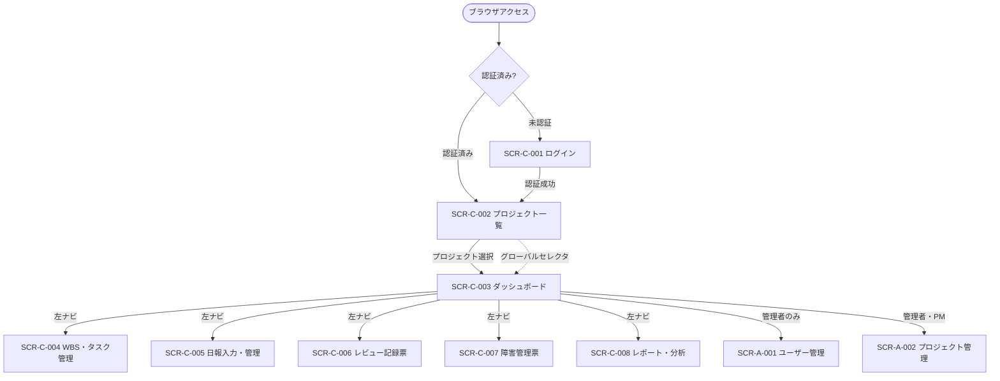

# 画面設計

## 画面一覧

### 一般ユーザー向け画面

| No | 画面ID | 画面名 | URL | 概要 | 認証要否 | アクセス権限 |
|----|--------|--------|-----|------|---------|-------------|
| 1 | SCR-C-001 | ログイン | `/login` | ID/パスワードによる認証 | 不要 | 全ユーザー |
| 2 | SCR-C-002 | プロジェクト一覧 | `/projects` | プロジェクト一覧・お気に入り登録 | 要 | 全ロール |
| 3 | SCR-C-003 | ダッシュボード | `/projects/[id]/dashboard` | プロジェクト主要指標のサマリー | 要 | 全ロール |
| 4 | SCR-C-004 | WBS・タスク管理 | `/projects/[id]/wbs` | タスク階層・ガントチャート・予実工数 | 要 | 閲覧: 全ロール / 編集: PM以上 |
| 5 | SCR-C-005 | 日報入力・管理 | `/projects/[id]/daily-reports` | 日報の登録・カレンダー/リスト表示 | 要 | 全ロール（PMO: 閲覧のみ）|
| 6 | SCR-C-006 | レビュー記録票 | `/projects/[id]/reviews` | レビュー指摘の登録・ステータス管理 | 要 | 全ロール（PMO: 閲覧のみ）|
| 7 | SCR-C-007 | 障害管理票 | `/projects/[id]/bugs` | 障害の登録・ステータス管理 | 要 | 全ロール（PMO: 閲覧のみ）|
| 8 | SCR-C-008 | レポート・分析 | `/projects/[id]/reports` | EVM・信頼性成長曲線・傾向分析 | 要 | 全ロール（閲覧のみ）|

### 管理者向け画面

| No | 画面ID | 画面名 | URL | 概要 | 必要権限 |
|----|--------|--------|-----|------|---------|
| 9 | SCR-A-001 | ユーザー管理 | `/admin/users` | ユーザー登録・編集・ロール管理 | 管理者 |
| 10 | SCR-A-002 | プロジェクト管理 | `/admin/projects` | プロジェクト登録・編集・アーカイブ | 管理者・PM |

---

## 画面遷移図



!!! info "サイドバーナビゲーションによる相互遷移"
    SCR-C-003〜008 および SCR-A-001〜002 は、左サイドバーのナビゲーションメニューにより任意の画面から相互に遷移できる。上記の図は初回アクセス時の主要フローを示している。

    グローバルセレクタ（ヘッダー上部）はプロジェクト一覧画面でお気に入り登録したプロジェクトを表示し、任意の画面からプロジェクトを即時切り替え可能。

---

## 共通レイアウト

ログイン画面（SCR-C-001）を除く全画面に以下のレイアウトを適用する。

```
+----------------------------------------------------------+
| ProjectHub | [現在のプロジェクト名 ▼]   | ユーザー名 [▼] |
+---------------------+------------------------------------+
|                     |                                    |
| ダッシュボード      |                                    |
| WBS・タスク管理     |   メインコンテンツエリア           |
| 日報入力・管理      |                                    |
| レビュー記録票      |                                    |
| 障害管理票          |                                    |
| レポート・分析      |                                    |
|                     |                                    |
| ── 管理 ──          |                                    |
| ユーザー管理   ※1   |                                    |
| プロジェクト管理 ※2 |                                    |
|                     |                                    |
+---------------------+------------------------------------+
      240px固定                  残余幅（可変）
```

| 領域 | 説明 |
|------|------|
| ロゴ | 「ProjectHub」。クリックでプロジェクト一覧へ遷移 |
| グローバルセレクタ | お気に入り登録済みプロジェクトをドロップダウンで即時切替。末尾に「全プロジェクト一覧 →」リンクを表示 |
| ユーザーメニュー（右上） | プロフィール確認・パスワード変更・ログアウトを表示 |
| サイドバーナビ | 現在のプロジェクトコンテキストで機能間を切替。アクティブ項目をハイライト表示 |
| ※1 管理者ロールのみ表示 | — |
| ※2 管理者・PMロールのみ表示 | — |

---

## 画面定義

### SCR-C-001: ログイン

| 項目 | 内容 |
|------|------|
| 画面ID | SCR-C-001 |
| URL | `/login` |
| 概要 | メールアドレスとパスワードによる認証。認証済みユーザーのアクセスはダッシュボードへリダイレクト。初回ログイン時はパスワード変更を強制 |
| 認証要否 | 不要 |
| 対応機能要件 | FR-AUTH-001 |

```
+-------------------------------+
|                               |
|   ProjectHub                  |
|   社内プロジェクト管理        |
|                               |
|   メールアドレス              |
|   [_________________________] |
|                               |
|   パスワード                  |
|   [_________________________] |
|                               |
|   [       ログイン       ]    |
|                               |
|   ─ エラーメッセージエリア ─  |
+-------------------------------+
```

**構成要素**

| No | 要素名 | 種類 | 内容 | 備考 |
|----|--------|------|------|------|
| 1 | メールアドレス | テキスト入力 | ログインID（メールアドレス形式） | 必須 |
| 2 | パスワード | パスワード入力 | パスワード | 必須 |
| 3 | ログインボタン | ボタン（primary） | 認証を実行 | — |
| 4 | エラーメッセージ | テキスト（赤） | 認証失敗時に表示 | 「IDまたはパスワードが正しくありません」（原因は非開示） |

**主要操作**

| No | 操作 | 処理内容 | 遷移先 |
|----|------|---------|--------|
| 1 | ログインボタン押下 | `POST /api/auth/signin` | 成功 → SCR-C-002（初回ログインは強制パスワード変更画面を挟む）/ 失敗 → エラー表示 |

---

### SCR-C-002: プロジェクト一覧

| 項目 | 内容 |
|------|------|
| 画面ID | SCR-C-002 |
| URL | `/projects` |
| 概要 | 参加プロジェクトの一覧表示・お気に入り登録管理。お気に入り登録したプロジェクトはグローバルセレクタに反映される |
| 認証要否 | 要 |
| 対応機能要件 | FR-WBS-007 |

```
+----------------------------------------------------------+
| ProjectHub                                | ユーザー名 [▼]|
+----------------------------------------------------------+
|  プロジェクト一覧          [+ 新規プロジェクト ※1]       |
|                                                          |
|  [検索___________________]      [状態: アクティブ ▼]    |
|                                                          |
|  +--+  ★/☆  +------- PJ名 -------+-- PM ---+-- 状態 --+|
|  |         ★ | プロジェクトA       | 田中    | 進行中  |→||
|  |         ☆ | プロジェクトB       | 鈴木    | 進行中  |→||
|  |         ☆ | プロジェクトC       | 山田    | 完了    |→||
|  +------------------------------------------------------+|
+----------------------------------------------------------+
※1 管理者・PMのみ表示
```

**構成要素**

| No | 要素名 | 種類 | 内容 | 備考 |
|----|--------|------|------|------|
| 1 | 検索フィールド | テキスト入力 | プロジェクト名でインクリメンタル絞り込み | — |
| 2 | 状態フィルタ | ドロップダウン | アクティブ / 全て / アーカイブ | デフォルト: アクティブ |
| 3 | お気に入りトグル | アイコン（★/☆） | グローバルセレクタへの追加/除去 | クリックで即時反映 |
| 4 | プロジェクト行 | リスト | PJ名・PM名・状態 | クリックでダッシュボードへ |
| 5 | 新規プロジェクトボタン | ボタン | 登録ダイアログを開く | ※1 管理者・PMのみ表示 |

**主要操作**

| No | 操作 | 処理内容 | 遷移先 |
|----|------|---------|--------|
| 1 | ★/☆クリック | `PUT /api/projects/[id]/favorite` | — （グローバルセレクタへ即時反映） |
| 2 | 行クリック / →ボタン | — | SCR-C-003 ダッシュボード |
| 3 | 新規プロジェクトボタン | — | 登録ダイアログ表示 |

---

### SCR-C-003: ダッシュボード

| 項目 | 内容 |
|------|------|
| 画面ID | SCR-C-003 |
| URL | `/projects/[id]/dashboard` |
| 概要 | プロジェクトの主要指標（SPI/CPI・障害数・レビュー未対応数・日報入力漏れ）をサマリー表示。各機能へのクイックアクセスを提供 |
| 認証要否 | 要 |
| 対応機能要件 | FR-REPORT-005、FR-DAILY-005 |

```
+----------------------------------------------------------+
| ProjectHub | [プロジェクトA ▼]          | ユーザー名 [▼]|
+---------------------+------------------------------------+
| ● ダッシュボード    |  ダッシュボード - プロジェクトA   |
|   WBS・タスク管理   |                                   |
|   日報入力・管理    |  [⚠ 日報未入力: 本日の日報が未登録です → 入力する]  |
|   レビュー記録票    |                                   |
|   障害管理票        |  +------------+ +------------+   |
|   レポート・分析    |  | 進捗指標    | | コスト効率  |  |
|                     |  | SPI: 0.95  | | CPI: 1.02  |  |
| ── 管理 ──          |  +------------+ +------------+  |
|   ユーザー管理      |  +------------+ +------------+   |
|   プロジェクト管理  |  | 未解決障害  | | 未対応指摘  |  |
|                     |  | 5件(高: 2件)| | 12件       |  |
|                     |  +------------+ +------------+   |
|                     |                                   |
|                     |  タスク完了率  ████░░░░  45%      |
+---------------------+------------------------------------+
```

**構成要素**

| No | 要素名 | 種類 | 表示内容 | 備考 |
|----|--------|------|---------|------|
| 1 | 日報未入力警告 | アラートバナー（黄） | 本日の日報未登録時に表示（平日のみ） | FR-DAILY-005対応。クリックで日報入力へ |
| 2 | 進捗指標カード | カード | SPI数値 | SPI < 0.8 で赤表示 |
| 3 | コスト効率カード | カード | CPI数値 | CPI < 0.8 で赤表示 |
| 4 | 未解決障害カード | カード | 未クローズ障害数（重要度別） | 致命的・高は赤表示 |
| 5 | 未対応指摘カード | カード | レビュー未対応件数 | — |
| 6 | タスク完了率 | プログレスバー | 完了タスク数 / 全タスク数 | — |

**主要操作**

| No | 操作 | 遷移先 |
|----|------|--------|
| 1 | 日報警告クリック | SCR-C-005 日報入力・管理 |
| 2 | 進捗指標カードクリック | SCR-C-008 レポート・分析（EVM タブ） |
| 3 | 未解決障害カードクリック | SCR-C-007 障害管理票 |
| 4 | 未対応指摘カードクリック | SCR-C-006 レビュー記録票 |

---

### SCR-C-004: WBS・タスク管理

| 項目 | 内容 |
|------|------|
| 画面ID | SCR-C-004 |
| URL | `/projects/[id]/wbs` |
| 概要 | WBSを階層ツリーで表示し、予定/実績工数を管理。ガントチャートビューへの切替可能。タスク登録・編集はスライドオーバーで行う |
| 認証要否 | 要 |
| 対応機能要件 | FR-WBS-001〜006 |

```
+----------------------------------------------------------+
| WBS・タスク管理  [WBSビュー][ガントチャート]  [+ タスク追加 ※1] |
|                                                          |
| タスク名               | 担当 | ステータス | 予定 | 実績 | 残余 |
| ▼ 1. 要件定義          | 田中 | 完了      |  20h |  18h |   0h |
|     1.1 ヒアリング     | 田中 | 完了      |   8h |   8h |   0h |
|     1.2 要件整理       | 鈴木 | 完了      |  12h |  10h |   0h |
| ▼ 2. 設計              | 鈴木 | 進行中    |  40h |  25h |  15h |
|     2.1 基本設計       | 鈴木 | 進行中    |  20h |  15h |   5h |
|     2.2 詳細設計       | 山田 | 未着手    |  20h |   0h |  20h |
|                                                          |
※1 PM以上のみ表示
```

ガントチャートビュー:

```
| タスク名         |  1月  |  2月  |  3月  |
| 1. 要件定義      | ████  |       |       |
|   1.1 ヒアリング | ██    |       |       |
|   1.2 要件整理   |   ██  |       |       |
| 2. 設計          |    ████████  |       |
                    [日][週][月] 切替
```

スライドオーバー（タスク登録/編集）:

```
                         +----------------------------+
                         | タスク登録／編集      [×] |
                         |                            |
                         | タスク名 ※                 |
                         | [_______________________]  |
                         | 親タスク                   |
                         | [ドロップダウン▼]          |
                         | 担当者 ※                   |
                         | [ドロップダウン▼]          |
                         | 開始日 ※      終了日 ※     |
                         | [日付___]    [日付___]     |
                         | 予定工数 ※                 |
                         | [___] 時間                 |
                         | ステータス                 |
                         | [ドロップダウン▼]          |
                         |                            |
                         |  [キャンセル]   [保存]     |
                         +----------------------------+
```

**構成要素**

| No | 要素名 | 種類 | 内容 | 備考 |
|----|--------|------|------|------|
| 1 | ビュー切替タブ | タブ | WBSツリー / ガントチャート | — |
| 2 | タスク追加ボタン | ボタン | スライドオーバーを開く | PM以上のみ表示 |
| 3 | WBSツリー | ツリーテーブル | タスク名・担当・ステータス・予実工数・残余 | ▼/▶で折りたたみ |
| 4 | ガントチャート | チャート | 横軸: 日付、縦軸: タスクのバーチャート | 日/週/月 切替可。D&Dで期間変更 |
| 5 | スライドオーバー | ドロワー（右寄せ） | タスク登録・編集フォーム | — |

**入力項目**

| No | 項目名 | 必須 | 入力種別 | バリデーション |
|----|--------|------|---------|--------------|
| 1 | タスク名 | 必須 | テキスト | 最大200文字 |
| 2 | 親タスク | 任意 | セレクト | 最大3階層まで |
| 3 | 担当者 | 必須 | セレクト | プロジェクト参加ユーザー |
| 4 | 開始日 | 必須 | 日付 | — |
| 5 | 終了日 | 必須 | 日付 | 開始日以降 |
| 6 | 予定工数 | 必須 | 数値 | 0より大きい値 |
| 7 | ステータス | 必須 | セレクト | 未着手 / 進行中 / 完了 / 保留 |

---

### SCR-C-005: 日報入力・管理

| 項目 | 内容 |
|------|------|
| 画面ID | SCR-C-005 |
| URL | `/projects/[id]/daily-reports` |
| 概要 | 日報（作業実績）の登録・閲覧。月次カレンダービューとリストビューを切替可能。スライドオーバーで日報を入力 |
| 認証要否 | 要 |
| 対応機能要件 | FR-DAILY-001〜005 |

カレンダービュー:

```
+----------------------------------------------------------+
| 日報入力・管理    [カレンダー][リスト]      [+ 日報入力] |
|                                                          |
|  ← 2025年 1月 →                      [表示: 自分 ▼]    |
|                                                          |
|  月      火      水      木      金                     |
|                   1      2      3                       |
|  6       7       8⚠    9✓    10                       |
|  13      14      15✓   16✓   17                       |
|  20      21      22✓   23✓   24                       |
|  27      28      29✓   30✓   31                       |
|                                                          |
|  ✓ = 入力済み   ⚠ = 未入力（平日）                     |
+----------------------------------------------------------+
```

リストビュー:

```
+----------------------------------------------------------+
| 期間: [2025/01/01] 〜 [2025/01/31]                      |
|                                                          |
| 日付      | タスク名         | 作業時間 | コメント  | 操作 |
| 2025/1/16 | 2.1 基本設計     | 4h       | 設計作業  | [編集]|
| 2025/1/16 | 1.2 要件整理     | 2h       | レビュー  | [編集]|
| 2025/1/15 | 2.1 基本設計     | 6h       | —         | [編集]|
+----------------------------------------------------------+
```

スライドオーバー（日報入力）:

```
                         +----------------------------+
                         | 日報入力               [×]|
                         |                            |
                         | 対象日 ※                   |
                         | [日付ピッカー___________]  |
                         |                            |
                         | 作業内容（複数行登録可）    |
                         |  WBSタスク ※ | 作業時間 ※  |
                         | [タスク▼   ] | [___] 時間  |
                         | [タスク▼   ] | [___] 時間  |
                         | [＋ 行を追加]              |
                         |                            |
                         | コメント                   |
                         | [____________________]    |
                         |                            |
                         |  [キャンセル]   [保存]     |
                         +----------------------------+
```

**入力項目**

| No | 項目名 | 必須 | バリデーション |
|----|--------|------|--------------|
| 1 | 対象日 | 必須 | 当日以前の日付のみ（将来日は不可） |
| 2 | WBSタスク | 必須（1行以上） | プロジェクトのWBSタスクから選択 |
| 3 | 作業時間 | 必須 | 0より大きい値（時間単位） |
| 4 | コメント | 任意 | 最大500文字 |

---

### SCR-C-006: レビュー記録票

| 項目 | 内容 |
|------|------|
| 画面ID | SCR-C-006 |
| URL | `/projects/[id]/reviews` |
| 概要 | レビューセッションと指摘事項の一覧表示・登録・ステータス管理。スライドオーバーで登録・編集 |
| 認証要否 | 要 |
| 対応機能要件 | FR-REVIEW-001〜005 |

```
+----------------------------------------------------------+
| レビュー記録票  [セッション一覧][指摘一覧]  [+ 登録 ※1] |
|                                                          |
| [ステータス: 全て ▼] [期間: ______〜______]              |
|                                                          |
| REV-ID  | 対象資料     | 実施日    | 指摘数 | 未対応 | 詳細|
| REV-001 | 要件定義書v1 | 2025/1/10 | 8件    | 2件    | [→] |
| REV-002 | 基本設計書v1 | 2025/1/20 | 5件    | 5件    | [→] |
|                                                          |
※1 PMO以外のロールが登録可
```

指摘一覧タブ:

```
| 指摘区分 ▼ | ステータス ▼ | 担当者 ▼ |             [+ 指摘登録]|
|                                                          |
| ID      | 指摘内容        | 区分     | 重要度 | 担当  | 状態  |
| RVC-001 | 認証フロー漏れ  | 設計漏れ | 高     | 田中  | 修正中|
| RVC-002 | バリデーション  | 実装誤り | 中     | 鈴木  | 未対応|
```

**構成要素**

| No | 要素名 | 内容 |
|----|--------|------|
| 1 | タブ切替 | レビューセッション一覧 / 指摘一覧 |
| 2 | フィルタ | ステータス・指摘区分・担当者・期間で絞り込み |
| 3 | 登録ボタン | スライドオーバーでレビューセッションまたは指摘を登録（PMO以外） |
| 4 | ステータス更新 | 指摘行のステータス列でインライン変更可 |

---

### SCR-C-007: 障害管理票

| 項目 | 内容 |
|------|------|
| 画面ID | SCR-C-007 |
| URL | `/projects/[id]/bugs` |
| 概要 | 障害の一覧表示・登録・ステータス管理。重要度・ステータスでフィルタリング可能。スライドオーバーで登録・編集 |
| 認証要否 | 要 |
| 対応機能要件 | FR-BUG-001〜005 |

```
+----------------------------------------------------------+
| 障害管理票                               [+ 障害登録 ※1]|
|                                                          |
| [重要度: 全て ▼] [ステータス: 未完了 ▼] [検索_______]   |
|                                                          |
| BUG-ID  | タイトル          | 重要度 | ステータス | 担当  |→|
| BUG-001 | ログイン不可      | 高     | 調査中     | 田中  |→|
| BUG-002 | ガント表示崩れ    | 低     | 修正中     | 鈴木  |→|
|                                                          |
※1 PMO以外のロールが登録可
```

障害詳細（スライドオーバー）で以下を表示・編集:

| 項目 | 内容 |
|------|------|
| 必須項目 | 障害ID（自動採番）・発生日・発見フェーズ・タイトル・重要度・ステータス・担当者 |
| 任意項目 | 詳細説明・再現手順・原因分析・対策内容・修正確認日・関連WBSタスク |

---

### SCR-C-008: レポート・分析

| 項目 | 内容 |
|------|------|
| 画面ID | SCR-C-008 |
| URL | `/projects/[id]/reports` |
| 概要 | EVM・信頼性成長曲線・指摘区分分析・障害密度分析のグラフを表示。全ロール閲覧のみ（データ変更不可） |
| 認証要否 | 要 |
| 対応機能要件 | FR-REPORT-001〜004 |

```
+----------------------------------------------------------+
| レポート・分析                                           |
|                                                          |
| [EVM分析][信頼性成長曲線][指摘区分分析][障害密度分析]    |
|                                                          |
| 期間: [2025/01/01] 〜 [2025/03/31]          [再集計]    |
|                                                          |
| EVM分析タブ:                                             |
|  工数 ↑                                                  |
|  (h)  |  ─── PV（計画価値）                             |
|       | ・・・AC（実コスト）                              |
|       | ─ ─ EV（出来高）                                |
|       +--------------------------------------------→ 日付|
|                                                          |
|  SPI: 0.95    CPI: 1.02    残工数: 120h                 |
+----------------------------------------------------------+
```

**構成要素**

| No | 要素名 | 種類 | 内容 |
|----|--------|------|------|
| 1 | タブ切替 | タブ | EVM分析 / 信頼性成長曲線 / 指摘区分分析 / 障害密度分析 |
| 2 | 期間フィルタ | 日付範囲 | グラフの集計期間を指定 |
| 3 | EVM折れ線グラフ | グラフ | PV/AC/EV推移（Recharts使用） |
| 4 | EVM派生指標 | 数値表示 | SPI・CPI・残工数 |
| 5 | 信頼性成長曲線 | 折れ線グラフ | 累積バグ発見数（赤）・累積修正完了数（青）の2系列 |
| 6 | 指摘区分分析 | 円グラフ＋テーブル | 指摘区分別の件数・割合 |
| 7 | 障害密度分析 | 棒グラフ＋テーブル | 担当者別・WBSモジュール別の障害件数 |

---

### SCR-A-001: ユーザー管理

| 項目 | 内容 |
|------|------|
| 画面ID | SCR-A-001 |
| URL | `/admin/users` |
| 概要 | ユーザーの登録・編集・ロール設定・有効/無効管理。管理者ロールのみアクセス可能 |
| 認証要否 | 要（管理者ロール必須） |
| 対応機能要件 | FR-AUTH-003〜006 |

```
+----------------------------------------------------------+
| ユーザー管理                          [+ ユーザー追加]  |
|                                                          |
| [検索___________________]     [有効/無効: 全て ▼]       |
|                                                          |
| 氏名      | メールアドレス       | ロール  | 有効 | 操作  |
| 田中 太郎 | tanaka@example.com  | PM      |  ✓  | [編集]|
| 鈴木 花子 | suzuki@example.com  | 開発者  |  ✓  | [編集]|
| 山田 一郎 | yamada@example.com  | 開発者  |  ✗  | [編集]|
+----------------------------------------------------------+
```

**入力項目**

| No | 項目名 | 必須 | バリデーション |
|----|--------|------|--------------|
| 1 | 氏名 | 必須 | 最大50文字 |
| 2 | メールアドレス | 必須 | メール形式、システム内で一意 |
| 3 | ロール | 必須 | 管理者 / PMO / PM / 開発者 |
| 4 | 初期パスワード | 必須（新規のみ） | 8文字以上、英字＋数字を各1文字以上含む |
| 5 | 有効/無効 | — | トグルで切替。無効化は論理削除（物理削除不可） |

---

### SCR-A-002: プロジェクト管理

| 項目 | 内容 |
|------|------|
| 画面ID | SCR-A-002 |
| URL | `/admin/projects` |
| 概要 | プロジェクトの登録・編集・アーカイブ。管理者および PM がアクセス可能 |
| 認証要否 | 要（管理者または PM ロール必須） |
| 対応機能要件 | FR-WBS-007 |

```
+----------------------------------------------------------+
| プロジェクト管理                [+ プロジェクト登録]    |
|                                                          |
| [検索___________________]     [状態: アクティブ ▼]      |
|                                                          |
| PJ名          | PM   | 開始日     | 状態    | 操作      |
| プロジェクトA  | 田中  | 2025/01/01 | 進行中  | [編集]    |
| プロジェクトB  | 鈴木  | 2024/10/01 | 完了    | [アーカイブ]|
+----------------------------------------------------------+
```

**入力項目**

| No | 項目名 | 必須 | バリデーション |
|----|--------|------|--------------|
| 1 | プロジェクト名 | 必須 | 最大100文字 |
| 2 | PM | 必須 | PMロール以上のユーザーから選択 |
| 3 | 開始日 | 必須 | 日付形式 |
| 4 | 終了予定日 | 任意 | 開始日以降 |
| 5 | 説明 | 任意 | 最大500文字 |
| 6 | 状態 | — | 進行中 / 完了 / アーカイブ |
