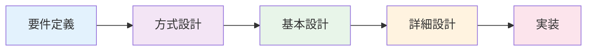

# Mobius Project Hub 設計ドキュメント

## プロジェクト概要

社内のプロジェクト進捗、工数、品質を統合管理し、データに基づいた意思決定を支援するWebアプリケーションを構築する。

| 項目 | 内容 |
|------|------|
| アプリケーション種別 | 社内プロジェクト管理ツール（業務システム） |
| 設計書テンプレート | Small |
| 主要ユーザー種別 | プロジェクトマネージャー、開発者 |
| 外部連携 | なし |
| 技術スタック | Next.js + Tailwind CSS + shadcn/ui + PostgreSQL + Docker |

### 主要機能

- **WBS・工数管理**: 親子構造のタスク登録、予定/実績工数管理、ガントチャート表示
- **日報・実績入力**: カレンダー/リスト形式での作業時間記録、バリデーション
- **レビュー記録票管理**: レビュー指摘の管理、指摘区分、ステータス追跡
- **障害管理票**: バグトラッキング、重要度管理、WBSタスクとの紐付け
- **レポート・分析**: EVM、信頼性成長曲線、傾向分析（指摘区分円グラフ、障害密度）

### 特記事項

- いずれもDockerコンテナ上での稼働を想定

## ドキュメント構成

| フェーズ | 内容 | 目的 |
|---------|------|------|
| 要件定義 (01-requirements/index.md) | ビジネス要件・機能要件・非機能要件 | 何を作るかを定義する |
| 方式設計 (02-technical-design/index.md) | アーキテクチャ・インフラ・セキュリティ・運用方式 | どの技術で作るかを決める |
| 基本設計 (03-basic-design/index.md) | 画面設計・データモデル・API設計 | どう作るかの全体像を設計する |
| 詳細設計 (04-detailed-design/index.md) | コンポーネント設計・テスト設計 | 実装レベルの詳細を設計する |

## 設計プロセスの流れ

!!! info "ドキュメントの進め方"
    各フェーズは上流から順に進めます。方式設計で技術方針を先に確定させることで、
    基本設計・詳細設計での手戻りを防ぎます。

## 成果物一覧

### フェーズ1: 要件定義

| # | 成果物 | 説明 | ステータス |
|---|--------|------|-----------|
| 1 | プロジェクト概要 | project-overview.md | 完了 |
| 2 | 機能要件 | functional-requirements.md | 完了 |
| 3 | 非機能要件 | non-functional-requirements.md | 完了 |

### フェーズ2: 方式設計

| # | 成果物 | 説明 | ステータス |
|---|--------|------|-----------|
| 4 | アーキテクチャ方式 | architecture.md | 完了 |
| 5 | インフラ・運用方式 | infrastructure.md | 完了 |

### フェーズ3: 基本設計

| # | 成果物 | 説明 | ステータス |
|---|--------|------|-----------|
| 6 | 画面設計 | screen-design.md | 完了 |
| 7 | データモデル | data-model.md | 未着手 |
| 8 | API設計 | api-design.md | 未着手 |

### フェーズ4: 詳細設計

| # | 成果物 | 説明 | ステータス |
|---|--------|------|-----------|
| 9 | コンポーネント設計 | component-design.md | 未着手 |
| 10 | テスト設計 | testing.md | 未着手 |
